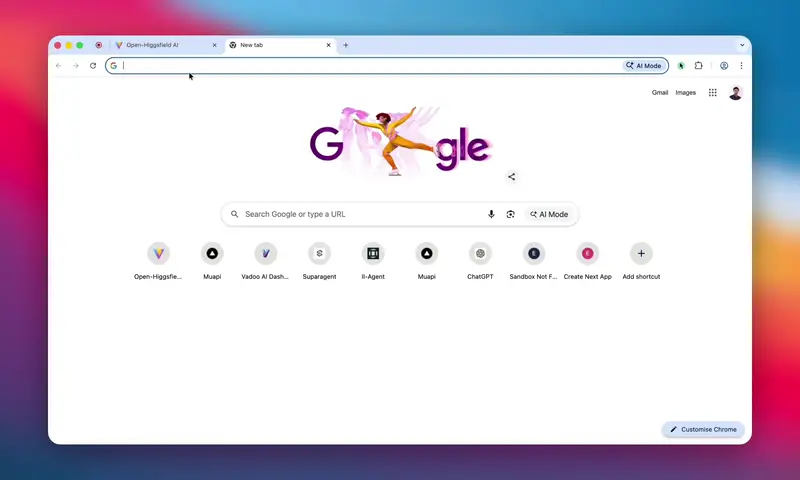

# SmartVideo

> **The free, open-source AI studio for images, video, and cinema.** Generate AI images and videos using 200+ state-of-the-art models — without the closed ecosystem or subscription fees.



## Table of Contents

1. [Project Overview](#project-overview)
2. [Features](#features)
3. [Technology Stack](#technology-stack)
4. [Installation](#installation)
5. [Configuration](#configuration)
6. [Architecture](#architecture)
7. [Core Features](#core-features)
   - [Image Generation](#image-generation)
   - [Video Generation](#video-generation)
   - [Cinema Studio](#cinema-studio)
   - [Template System](#template-system)
   - [AI Model Integration](#ai-model-integration)
8. [API Reference](#api-reference)
   - [Authentication](#authentication)
   - [Endpoints](#endpoints)
   - [Method Signatures](#method-signatures)
9. [Database Schema](#database-schema)
10. [Usage Examples](#usage-examples)
11. [Contributing](#contributing)
12. [License](#license)
13. [Troubleshooting](#troubleshooting)
14. [Credits](#credits)

---

## Project Overview

SmartVideo is an open-source AI image, video, and cinema studio that brings cinematic AI creative workflows to everyone. Powered by [Muapi.ai](https://muapi.ai), it supports:

- **Text-to-Image** generation (50+ models)
- **Image-to-Image** transformation (55+ models)
- **Text-to-Video** generation (40+ models)
- **Image-to-Video** animation (60+ models)
- **Video-to-Video** processing

### Why SmartVideo?

| Feature | Commercial Tools | SmartVideo |
|---------|---------------|---------------------|
| **Cost** | Subscription-based | Free (open-source) |
| **Models** | Proprietary | 200+ open & commercial models |
| **Multi-image input** | Limited | Up to 14 images per request |
| **Self-hosting** | No | Yes |
| **Customizable** | No | Fully hackable |
| **Data privacy** | Cloud-based | Your data stays local |
| **Source code** | Closed | MIT licensed |

---

## Features

### Studios

| Studio | Description |
|--------|-------------|
| **Image Studio** | Dual-mode Text-to-Image and Image-to-Image generation with 50+ t2i models and 55+ i2i models |
| **Video Studio** | Triple-mode Text-to-Video, Image-to-Video, and Video-to-Video generation with 40+ t2v, 60+ i2v, and v2v models |
| **Cinema Studio** | Professional cinematography controls with Cinema Prompt Builder, Camera Builder, lens, focal length, and aperture settings |
| **Effects Studio** | 350+ visual effects and motion controls across Image Effects, Nano Banana, Kontext Effects, AI Video Effects, Motion Controls, and Video FX v2 tabs |
| **Edit Studio** | 13 AI-powered editing tools: Remove Object, Remove Background, Extend Image, AI Edit, Reframe, Change Dress, Enhance Skin, Colorize, Add Watermark, Upscale, Face Swap, Product Shot, and Ghibli Style |
| **Character Studio** | Consistent character generation using Flux PuLID and Subject Reference models with Expression Presets and a saved Character Library |
| **Storyboard Studio** | Multi-frame storyboard creation with add/remove frames, shot type selectors, narration inputs, and JSON export |
| **Commercial Studio** | Product photography and advertising content with scene presets and format presets |
| **Upscale Suite** | AI image enhancement using 3 methods: AI Upscaler (2x/4x), Topaz Upscale, and Seed Upscale |
| **AI Influencer Studio** | Social media optimized generation with 20+ style presets and format presets |
| **Audio Studio** | Music and speech generation with style selectors, duration controls, and model selection |
| **Avatar Studio** | Talking avatars and lip sync video generation with source video/image and audio uploads |
| **Training Studio** | Train custom LoRA models from images with LoRA name, trigger word, epoch selection, and multi-image upload |
| **Video Tools Studio** | Enhance, edit, and transform videos with AI including watermark removal and upscaling |
| **Chat Studio** | AI-powered text generation and conversation with system prompts, advanced parameters (Temperature, Max Tokens), and chat history |
| **Lip Sync Studio** | Animate portraits or sync lips to audio with AI using dual input modes (Portrait Image or Video), audio upload, and resolution selection |
| **Video Render** | Review, refine, and process generated videos with cinematic presets, render queue management, action tiles (Create Shorts, Generate Highlights, Add Subtitles, Dub, etc.), quick utilities, and export settings |
| **Cinema Template Studio** | Cinematic template system with Browse, Create, Storyboard, and Preview views; Quick Mode and Advanced Mode; scene builders; brand context inputs; and extensive cinematic categories including Cinematic Films, Business & Brand, Commercial & Ads, Social Media, Documentary, and industry-specific verticals |

#### Image Studio Features

- **Dual-mode generation**: Text-to-Image (50+ models) and Image-to-Image (55+ models)
- **Multi-image input**: Upload up to 14 reference images for compatible models
- **Advanced parameters**: Negative prompt, guidance scale, steps, seed, custom width/height
- **Reference strength**: Style reference control (0-100) for supported models
- **LoRA support**: Load custom LoRA models from Civitai with adjustable weight
- **Batch count**: Generate multiple variations in one request
- **Quick tools panel**: Fast access to common editing operations
- **Aspect ratios**: 1:1, 16:9, 9:16, 4:3, 3:4, 3:2, 2:3, 21:9
- **Resolution/Quality pickers**: Dynamic model-specific options
- **GTM Boost prompt enhancer modal**: AI-powered prompt optimization
- **Personalize popover**: Inject contact context into prompts
- **Auth modal**: Secure API key management
- **Upload history**: Reuse previously uploaded images

#### Video Studio Features

- **Triple-mode generation**: Text-to-Video (40+ models), Image-to-Video (60+ models), Video-to-Video (watermark remover)
- **Duration selector**: 3-15 seconds (model dependent)
- **Resolution picker**: 480p, 720p, 1080p (model dependent)
- **Quality selector**: Basic and High
- **Aspect ratio selector**: Model-specific options
- **Advanced options panel**: Negative prompt and seed controls
- **Seedance 2.0 Extend**: Seamlessly extend previous Seedance 2.0 generations
- **Regenerate and Extend buttons**: One-click iteration on past results
- **Video upload**: Supports v2v mode for watermark removal
- **GTM Boost prompt enhancer modal**: AI-powered prompt optimization
- **Personalize popover**: Inject contact context into prompts
- **Auth modal**: Secure API key management

#### Cinema Studio Features

- **Cinema Prompt Builder**: Collapsible panel to build prompts with camera and lens metadata
- **Camera Builder**: Select camera type, lens, focal length, and aperture
- **Camera overlay**: Full-screen camera controls overlay with live preview
- **Camera types**: Modular 8K Digital, Full-Frame Cine Digital, Grand Format 70mm Film, Studio Digital S35, Classic 16mm Film, Premium Large Format Digital
- **Lens options**: Creative Tilt, Compact Anamorphic, Extreme Macro, 70s Cinema Prime, Classic Anamorphic, Premium Modern Prime, Warm Cinema Prime, Swirl Bokeh Portrait, Vintage Prime, Halation Diffusion, Clinical Sharp Prime
- **Focal lengths**: 8mm through 85mm
- **Apertures**: f/1.4, f/4, f/11
- **Aspect ratios**: 16:9, 21:9, 9:16, 1:1, 4:5
- **Resolution picker**: 1K, 2K, 4K
- **Summary card**: Live display of current camera settings
- **Personalize trigger**: Inject contact context into prompts
- **Auth modal**: Secure API key management

#### Effects Studio Features

- **350+ effects and motion controls** organized across 6 tabs:
  - Image Effects
  - Nano Banana
  - Kontext Effects
  - AI Video Effects
  - Motion Controls
  - Video FX v2
- **Effect search**: Real-time search across all effects
- **Split preview panel**: Input and Output side-by-side comparison
- **Mobile responsive controls**: Dedicated mobile upload and preview layout
- **Prompt input**: Optional prompt to guide effect application
- **Apply Effect button**: One-click effect processing
- **Personalize trigger**: Inject contact context into prompts
- **Auth modal**: Secure API key management

#### Edit Studio Features

- **13 AI-powered editing tools**:
  1. **Remove Object** — Erase unwanted objects with AI
  2. **Remove Background** — Clean background removal
  3. **Extend Image** — AI outpainting to expand canvas
  4. **AI Edit** — Instruction-based image editing (Seedream 5.0)
  5. **Reframe** — Change aspect ratio intelligently (Ideogram v3)
  6. **Change Dress** — AI outfit and clothing swap
  7. **Enhance Skin** — Professional skin retouching
  8. **Colorize** — Add color to black and white photos
  9. **Add Watermark** — Overlay custom watermark text
  10. **Upscale** — AI image upscaling to higher resolution
  11. **Face Swap** — Swap faces between images
  12. **Product Shot** — Create professional product images
  13. **Ghibli Style** — Transform into Studio Ghibli art style
- **Tool grid**: Visual card-based tool selection with thumbnails
- **Upload image/video**: Supports both image and video sources
- **Prompt field**: Dynamic prompt input for tools that require text guidance
- **Download result**: One-click download of edited media
- **Personalize trigger**: Inject contact context into prompts
- **Auth modal**: Secure API key management

#### Character Studio Features

- **2 character preservation models**: Flux PuLID and Subject Reference
- **Reference face upload**: Upload a clear face photo or video
- **Character description prompt**: Text guidance for generation
- **Expression Presets**: Happy, Sad, Angry, Surprised, Neutral — one-click prompt injection
- **Character Library**: Save and load saved characters from localStorage with thumbnails and descriptions
- **Download result**: Save generated character images
- **Generate Again**: Quick regeneration without re-entering data
- **Personalize trigger**: Inject contact context into prompts
- **Auth modal**: Secure API key management

#### Storyboard Studio Features

- **Multi-frame generation**: Create storyboards with unlimited frames
- **Add/Remove frames**: Dynamic frame management
- **Shot type selector**: Wide Shot, Medium Shot, Close-Up, Extreme Close-Up, POV, Overhead, Low Angle
- **Layout selector**: Horizontal, Grid, or Story layout
- **Per-frame inputs**: Individual scene description and narration text for each frame
- **Generate Frame**: Generate individual frames on demand
- **Generate All Frames**: Batch generate all populated frames
- **Export JSON**: Download storyboard data as JSON
- **Personalize trigger**: Inject contact context into prompts
- **Auth modal**: Secure API key management

#### Commercial Studio Features

- **2 product models**: Product Shot and Product Photography
- **Product media upload**: Upload product image or video
- **9 Scene Presets**: Studio white background, Luxury marble surface, Outdoor natural light, Lifestyle kitchen counter, Neon tech showroom, Wooden table cozy, Minimalist gradient, Beach sand and waves, Office desk setup
- **4 Output Formats**: Ad Banner (16:9), Social Post (1:1), Story (9:16), Billboard (21:9)
- **Generate Product Shot**: One-click commercial content generation
- **Download result**: Save generated product images
- **Generate Again**: Quick regeneration
- **Auth modal**: Secure API key management

#### Upscale Suite Features

- **3 upscaling methods**:
  1. **AI Upscaler** — General-purpose AI upscaling with 2x and 4x factors
  2. **Topaz Upscale** — Premium Topaz-quality enhancement
  3. **Seed Upscale** — SeedVR2 high-fidelity upscaling
- **Factor selection**: 2x or 4x upscale (for AI Upscaler method)
- **Upload image/video**: Supports both image and video sources
- **Upscale Image button**: One-click enhancement
- **Download result**: Save upscaled media
- **Auth modal**: Secure API key management

#### AI Influencer Studio Features

- **20+ Style Presets**: Realistic, DigitalCam, Quiet luxury, FashionShow, 90s Grain, Sunset beach, Amalfi Summer, Bimbocore, Vintage PhotoBooth, Gorpcore, Indie sleaze, Fairycore, Avant-garde, Y2K Posters, Grunge, Coquette core, Tokyo Streetstyle, 2049, Night rider, Glazed doll skin makeup
- **4 Output Formats**: Instagram Post (1:1), Story/Reel (9:16), YouTube Thumb (16:9), Pinterest Pin (2:3)
- **Reference upload**: Upload reference photo or video
- **Additional instructions prompt**: Optional text guidance
- **Generate Content button**: One-click social content generation
- **Download result**: Save generated images
- **Generate Again**: Quick regeneration
- **Personalize trigger**: Inject contact context into prompts
- **Auth modal**: Secure API key management

#### Audio Studio Features

- **Music and speech generation**: Multiple AI audio models
- **Prompt input**: Describe the music or speech you want
- **Style selector**: Pop, Rock, Electronic, Classical, Jazz, Hip Hop, Ambient
- **Duration selector**: 15s, 30s, 60s, 120s
- **Model selector**: Choose between available audio models
- **Generate Audio button**: One-click audio generation
- **Download Audio**: Save generated audio files
- **Personalize trigger**: Inject contact context into prompts
- **Auth modal**: Secure API key management

#### Avatar Studio Features

- **Multiple avatar models**: Various avatar generation models with different capabilities
- **Source video/image upload**: Upload source video or image for avatar generation
- **Audio upload**: Upload audio file for lip sync models
- **Prompt input**: Optional text guidance for some models
- **Model selector**: Switch between avatar models
- **Dynamic form visibility**: Form adapts based on selected model requirements (video required, audio required, prompt required)
- **Generate Avatar Video button**: One-click avatar generation
- **Download Video**: Save generated avatar videos
- **Auth modal**: Secure API key management

#### Training Studio Features

- **Custom LoRA training**: Train LoRA models from your own images
- **LoRA Name**: Custom name for the trained model
- **Trigger Word**: Optional trigger word for activating the LoRA
- **Training Epochs**: Choose 5, 10, 20, or 30 epochs
- **Multi-image upload**: Upload 10-20 training images (recommended)
- **Image count display**: Shows number of selected images
- **Model selector**: Choose training model
- **Train LoRA button**: Start training process
- **Auth modal**: Secure API key management

#### Video Tools Studio Features

- **Video enhancement models**: Upscale, edit, translate, and transform videos with AI
- **Source video upload**: Upload video for processing
- **Prompt input**: Optional text guidance for some models
- **Model selector**: Switch between video tool models
- **Dynamic form visibility**: Shows prompt only when model supports it
- **Process Video button**: One-click video processing
- **Download result**: Save processed videos
- **Personalize trigger**: Inject contact context into prompts
- **Auth modal**: Secure API key management

#### Chat Studio Features

- **AI-powered text generation**: Multiple LLM models
- **Model selector**: Switch between text models
- **Chat history**: Conversation display with user and AI message bubbles
- **System prompt**: Optional system prompt input
- **Message textarea**: Multi-line input with Shift+Enter support
- **Advanced Options**: Temperature (0-2) and Max Tokens (1-4096) controls
- **Send button**: Submit messages with keyboard shortcut (Enter)
- **Loading indicator**: Animated bounce dots while generating
- **Auth modal**: Secure API key management

#### Lip Sync Studio Features

- **Dual input modes**: Portrait Image mode and Video mode
- **Image mode**: Upload portrait image + audio to animate
- **Video mode**: Upload video + audio to sync lips
- **Audio upload**: Upload audio file for lip sync
- **Prompt input**: Optional description of talking style or motion
- **Model selector**: Choose between lip sync models
- **Resolution selector**: Select output resolution (480p and up, model dependent)
- **Mode switching**: Toggle between image and video modes
- **Upload state indicators**: Idle, Spinner, and Ready states for all uploads
- **Generate button**: One-click lip sync generation
- **Personalize trigger**: Inject contact context into prompts
- **Auth modal**: Secure API key management

#### Video Render Features

- **Video preview player**: Full video playback with custom controls
- **Connected Pipeline info**: Shows active processing pipeline and preset
- **Action Tiles**: Create Shorts, Generate Highlights, Add Subtitles, Dub/Voiceover, Trailer Cut, Social Resize
- **Quick Utilities**: AI Auto-Edit, Agentic Editor, Full Editor, Copy Prompt, Duplicate Render, Save as Template, Send to Storyboard, Publish/Deliver
- **Cinematic Presets**: Luxury Brand Grade, Documentary Contrast, Film Trailer Punch, Emotional Story Tone
- **Preset details**: Color Profile, Pacing, Export Profile
- **Render Queue**: Visual job queue with remove capability
- **Saved items panel**: Drafts and saved templates
- **Stats display**: Duration, Resolution, Estimated Time
- **Export settings**: Format, Frame Rate, Quality
- **Action buttons**: Export Video, Download Frame, Queue Render, Trailer Cut, Social Resize, Remix Scene
- **Preset configuration**: Color profile, pacing, music mood, caption style, export profile, finish

#### Cinema Template Studio Features

- **Browse View**: Template library with Favorites, Recent, and My Templates filters
- **Create View**: Two modes — Quick Mode and Advanced Mode
- **Quick Mode**: Simple inputs for fast template generation
- **Advanced Mode**: Full Scene Builder and Shot Builder control
- **Brand Context Inputs**: Add brand details for consistent messaging (when applicable)
- **Scene Builder**: Structure video into scenes with timing and sequencing
- **Storyboard View**: Visual storyboard editor for template planning
- **Preview Panel**: Real-time preview of generated content
- **Save functionality**: Save custom templates
- **Cinematic Categories**: Cinematic Films, Business & Brand, Commercial & Ads, Social Media, Documentary, Personal Story, Industry Specific, Creative & Artistic, Narrative & Story, Film Genres, Scene Construction, Movie Poster & Promo, and niche verticals (Restaurant, Med Spa, Salon, Fitness, Real Estate, Dental, Chiropractic, Legal, Automotive, Fashion, Event, Luxury)
- **Output Styles**: Cinematic Commercial, Documentary, Emotional Brand Story, Bold Direct Response Ad, Luxury Brand Promo, Dramatic Trailer, Inspirational Founder Film, Customer Transformation Story, Cinematic Social Short
- **Template customization**: Visual styles, shot types, camera movements, pacing options, CTA types, ending types, brand voices, target audiences, and scene structures

#### Modal Features

- **Auth Modal**: API key entry and validation, shown when authentication is required
- **Personalize Modal**: Contact profile selection and prompt personalization popover used across studios
- **GTM Prompt Modal**: AI-powered prompt enhancement using GTM conversion frameworks (available in Image Studio and Video Studio)
- **Template Thumbnail Modal**: Custom thumbnail selection and upload for templates
- **Cinematic Template Wizard**: Step-by-step cinematic template builder (accessible from TemplateStudio for cinematic-tagged templates)

#### Shared Capabilities

- **Multi-Image Input** — Upload up to 14 reference images for compatible models
- **Upload History** — Local storage of uploaded images with reuse capability
- **Generation History** — Browse, revisit, and download past generations
- **Smart Controls** — Dynamic aspect ratio, resolution/quality, duration pickers
- **API Key Management** — Secure localStorage storage (only sent to Muapi)
- **Responsive Design** — Dark glassmorphism UI, works on desktop and mobile
- **One-Click Download** — Full resolution image/video download

#### Video Agent Features

The Video Agent is an AI-powered video processing and enhancement workspace for analyzing, transforming, and repurposing generated or uploaded video. It is reachable from the sidebar and the landing page.

- **Sidebar navigation entry** — dedicated "Video Agent" launcher in the app sidebar
- **Landing page card** — "Video Agent" tile describing AI-assisted creation, editing decisions, creative direction, workflow steps, and content generation
- **Video preview player** — loads a source video (via `videoId` / `videoUrl` query params) with native playback controls; shows an empty-state placeholder when no video is loaded
- **Back button** — returns to the Render workspace, preserving the loaded video context
- **AI Processing Tools grid** — 12 tools grouped by category:
  - *Understand* — Scene Detection, Highlight Detection, ImageBind (multimodal understanding)
  - *Edit* — Clip Segmentation
  - *Audio* — CosyVoice (voice cloning & TTS), Fish Speech (voice synthesis), Seed-VC (voice conversion), Whisper (audio transcription), Cross-lingual Dub (translate & dub)
  - *Enhance* — Color Correction, Video Upscale, Stabilize
- **AI Use Cases grid** — 6 one-click creative workflows:
  - Stand-up Comedy (comedy timing), Commentary (AI commentary overlay), Video Overview (summary overview), Meme Generator, Music Video (beat-synced), Video Q&A (interactive)
- **Category filter tabs** — ALL / UNDERSTAND / EDIT / AUDIO to filter the tools grid
- **Processing Queue** — live list of jobs with pending / running (spinner) / complete (check) status indicators
- **Run Full Pipeline button** — chains Scene Detection → Clip Segmentation → Highlight Detection → Transcription → Color Correction → Final Export as a single orchestrated job
- **Settings panel**:
  - Output Quality selector (720p / 1080p / 4K)
  - Output Format selector (MP4 / WebM / MOV)
  - Auto-save results toggle
- **Processing Modal** — full-screen overlay with spinner, job name, animated progress bar + percentage, ordered step list (e.g. "Analyzing video frames… → Detecting scene changes… → Labeling scenes… → Generating scene map…"), and a **Cancel** button
- **Results Panel** — lists each completed job with a summary derived from the actual payload (transcript text, scene count, highlight count, subtitle segment count, generated voice size, etc.) and a **Download result** button (downloads WebM video or audio from `audioBase64`)
- **Cancellation** — aborts the in-flight job via `AbortController` and calls the cancel endpoint
- **Multi-backend orchestration** — tries the Express backend (`/videoagent/process`) → Supabase edge function → in-browser FFmpeg-free fallback (`browserVideoProcessor`) → offline simulation, in that order
- **In-browser fallback processor** — decodes frames, transforms them in a Web Worker, and re-encodes to WebM via `MediaRecorder` for color-correct, stabilize, upscale, and create-shorts; frame-sampling analysis for detect-scenes / extract-highlights

##### Video Agent Backend Actions

Server-side orchestration endpoints and per-action step lists exposed to the UI:

- **AI Tools** (12): scene-detection, clip-segmentation, highlight-detection, cosyvoice, fish-speech, seed-vc, whisper, imagebind, dubbing, color-correct, upscale, stabilize
- **Use Cases** (6): standup, commentary, overview, meme, music-video, qa
- **Quick Actions**: summarize-video, extract-highlights, detect-scenes, generate-subtitles, dub-video, add-broll, add-voiceover, create-shorts
- **Processing endpoints**: `/process` (process-tool / process-usecase / full-pipeline), `/job/:jobId` (poll status), `/workflow` (batched multi-step), `/cancel/:jobId`, `/transcribe` (Whisper), `/tts/synthesize` (OpenAI TTS)
- **Bridge service** implements detect-scenes, extract-highlights, add-broll, create-shorts, color-correct, upscale, stabilize, dub-video, add-voiceover, generate-subtitles, summarize-video, scene-detection, highlight-detection, clip-segmentation with real Whisper/TTS/FFmpeg/MuAPI/Director backends and graceful placeholders

#### Timeline Editor Features

The Timeline Editor is a full non-linear video editing surface with multi-track timelines, AI agent integration, keyframe animation, multi-camera compositing, and a large catalog of integrated modals and editing tools.

- **Sidebar navigation entry** — dedicated "Timeline" launcher
- **Hero banner** — timeline-branded hero section
- **Design system enforcement** — a shared design system (CSS variables, modal/button/card classes, animations, drag-and-drop styling, loading states, and validators) applied to every integrated feature and modal
- **Feature flags** — toggleable gates: color correction, CutAI storyboard, CineGen tools, agent integration, subtitle generation
- **Drag-and-drop media ingest** — upload sources, media library grid, drag media onto tracks
- **Subtitle system** — Whisper-based subtitle generation, subtitle timeline tracks, subtitle controls, and subtitle editor modal
- **Retake panel** — generate, compare, select, and delete multiple AI takes per clip
- **IC LoRA panel** — inject custom LoRA references for generation
- **Import timeline modal** — import external timeline projects

##### AI Feature Panel (side panel)

Six AI feature buttons, each opening a dedicated modal:

1. **AI Workflow** — node-based generation pipeline canvas supporting 50+ models for image/video/audio generation
2. **AI Tools** — Fill Gap (model + duration), Extend Clip (before/after/both + duration), Generate Music (genre + mood presets), SAM3 Masking (text / bounding-box / click segmentation)
3. **Elements Library** — reusable Characters, Locations, Props, Vehicles elements with create-new-element workflow
4. **AI Assistant** — context-aware chat with modes: Ask, Search, Cut, Timeline
5. **NLE Tools** — 10 professional editing tools (Select, Blade, Ripple, Roll, Slip, Slide) + viewer modes (Source, Timeline, Split View) + New Timeline Tab
6. **Export** — quality presets (Draft 720p@24fps / Standard 1080p@30fps / High 4K@60fps), aspect ratio (16:9, 4:3, 21:9, 1:1, 9:16), format (MP4/WebM/MOV)

##### Multi-Camera & Compositing

- **Multi-Camera Mode** toggle
- **PIP (Picture-in-Picture)** mode toggle with PIP window controls (position: top-left/top-right/bottom-left/bottom-right/custom; per-window opacity; add/remove PIP windows)
- **Split Screen** mode toggle (horizontal / vertical / quad) with adjustable split ratio
- **Camera Angles** panel — add, switch, and remove camera angles (each with color and tracked clips)
- **Compositing modes** — normal and other blend/composite options

##### Keyframe Animation System

- **Animatable properties** — Position (X/Y), Scale (uniform + independent X/Y 0–500%), Rotation, Opacity, Crop/Mask, Color Effects (brightness/contrast/saturation), Motion Blur, Playback Rate (speed ramping)
- **Keyframe editor** — timeline-based diamonds, property curves, click-to-add keyframes, multi-selection, property panel
- **Animation controls** — play / pause / stop / rewind, easing curves (linear, ease-in/out, custom Bézier), interpolation modes (smooth / step / hold), keyframe copy/paste, speed 0.1x–4x, loop/reverse
- **Motion graphics** — motion blur simulation, speed ramping, layer parenting, anchor-point manipulation, drop shadows/glows/filters
- **Timeline integration** — keyframe indicators, context-sensitive property panel, keyframe scrubbing, zoom/pan

##### Agent System (ViMax-inspired)

- **Agent panel** with Timeline Analysis (Full Analysis, Structure, Gap Detection), Content Generation (Generate Takes, Fill Gaps, Transitions), and Character Tracking (Track Characters, Consistency) sections
- **Agents**: Director, CharacterExtractor, Screenwriter, CameraOperator, Editor, CineGen, plus an Agent Orchestrator
- **Workflows**: analyze_timeline, full_timeline_review, script_assistance, camera_analysis, cinegen_edit
- **Timeline hooks** — auto-suggest gap fills, gap-fill previews, director analysis, character-consistency checks, initial-analysis on load, take tracking on retakes
- **Take selector** — generate, compare, select, delete takes
- **CineGen tools**: gap_fill, extend, music_generation, mask_tool, element_create, llm_chat, fill_gap, extend_clip, sam3_segment, audio_sync, layer_decompose, shot_board, proxy_playback, composition_plan

##### Project Persistence

- **Save / Load / Autosave / Restore** across localStorage, IndexedDB, and optional Supabase cloud sync
- **Versioning** — every save records a version (max 10); load returns latest
- **Migration** — on load, automatically migrates older project schemas (left/width → start/end, legacy clips → items, etc.)
- **State manager** — centralized timeline state with subscription pattern, snap, auto-scroll, ruler, waveform toggles, track lock/mute/solo/visible, markers, captions, effects

##### Integrated Modals & Components

The Timeline Editor surfaces the following modals and panels:

- **End Screen Modal** — end-card / outro builder
- **Save Project Modal** — save/name/version the current project
- **Settings Modal** — editor and account settings
- **Connect Modal** — connect external services / API keys
- **Preview Media Modal** — preview individual media assets
- **Video Player Modal** — full video player overlay
- **Recorder Modal** — basic media recorder
- **Enhanced Recorder Modal** — advanced recorder with teleprompter support
- **Template Generator Modal** — generate templates from content
- **Template Preview Modal** — preview a template before use
- **Social Publisher Modal** — publish to social platforms
- **Email Campaign Modal** — embed personalized video in email campaigns
- **URL Video Modal** — import video from a URL
- **Page Shot Modal** — capture webpage screenshots as backgrounds
- **Contact Importer Modal** — import CSV / CRM / manual contacts
- **AI Video Creator Modal** — AI-assisted video creation
- **Video Personalization Hub** — orchestration hub with tabs: Upload Video, Import Contacts, Configure Tokens, Generate Videos, Create Landing Pages, View Analytics; content-type buttons (Greeting, Product Offer, Testimonial, Import Contacts); overlay/lead-form buttons (Add Text Overlay, Add Image Overlay, Add Voice Narration, Add Lead Form); landing-page template picker (Professional/Corporate/Modern/Minimal); analytics dashboard (views, engagement, retention, shares, performance chart, AI insights)
- **Landing Page Builder Modal** — drag-and-drop landing page builder with template selector, page canvas, branding panel
- **Lead Generator Modal** — capture lead forms
- **Subtitle Editor Modal** — edit generated subtitle tracks
- **CutAI Storyboard integration** — draggable scene/shot cards dropped directly onto the timeline, plus a "Send to Timeline" button that converts a storyboard into timeline clips

---

## Technology Stack

| Layer | Technology |
|-------|------------|
| **Build Tool** | Vite |
| **Styling** | Tailwind CSS v4 |
| **Frontend** | Vanilla JavaScript |
| **AI API Gateway** | Muapi.ai |
| **Database** | Supabase (optional) |
| **Package Manager** | npm |

---

## Installation

### Prerequisites

- [Node.js](https://nodejs.org/) (v18+)
- A [Muapi.ai](https://muapi.ai) API key

### Quick Start

```bash
# Clone the repository
git clone https://github.com/Anil-matcha/SmartVideo.git
cd SmartVideo

# Install dependencies
npm install

# Start the development server
npm run dev
```

Open `http://localhost:5173` in your browser. You'll be prompted to enter your Muapi API key on first use.

### Production Build

```bash
# Build for production
npm run build

# Preview production build
npm run preview
```

---

## Configuration

### Environment Variables

Create a `.env` file in the project root:

```bash
# Supabase Configuration (Optional)
VITE_SUPABASE_URL=your_supabase_project_url
VITE_SUPABASE_ANON_KEY=your_supabase_anon_key
```

### API Key Setup

1. Get an API key from [Muapi.ai](https://muapi.ai)
2. Enter the API key in the app's settings modal
3. The key is stored securely in your browser's localStorage

### Supabase Setup (Optional)

To enable cloud storage for generations, characters, and storyboards:

1. Create a [Supabase](https://supabase.com) project
2. Run the migrations in `supabase/migrations/`
3. Add your Supabase credentials to the `.env` file

```bash
# Apply migrations
supabase db push
```

---

## Architecture

### Directory Structure

```
src/
├── components/           # UI Components
│   ├── AppsHub.js       # Application launcher hub
│   ├── AuthModal.js     # API key authentication modal
│   ├── CameraControls.js # Cinema studio camera controls
│   ├── CharacterStudio.js # Character creation studio
│   ├── CinemaStudio.js  # Pro cinematography interface
│   ├── CommercialStudio.js # Product photography
│   ├── CommunityPage.js # Community features
│   ├── EditStudio.js    # Image editing tools
│   ├── EffectsStudio.js # VFX and effects
│   ├── ExplorePage.js   # Gallery/exploration
│   ├── Header.js        # App header with navigation
│   ├── ImageStudio.js   # Image generation (t2i/i2i)
│   ├── InfluencerStudio.js # AI influencer content
│   ├── InlineInstructions.js # Tutorial overlays
│   ├── LibraryPage.js   # Generation library
│   ├── MediaPreview.js  # Media display component
│   ├── SettingsModal.js # Settings panel
│   ├── Sidebar.js       # Navigation sidebar
│   ├── StoryboardStudio.js # Storyboard creation
│   ├── TemplateStudio.js # Template-based generation
│   ├── TemplatesPage.js # Template browser
│   ├── UploadPicker.js  # Image upload & history picker
│   ├── UpscaleStudio.js # Image enhancement
│   └── VideoStudio.js   # Video generation (t2v/i2v)
├── lib/                 # Core Libraries
│   ├── muapi.js        # API client for Muapi.ai
│   ├── models.js       # 200+ model definitions
│   ├── router.js       # Client-side routing
│   ├── supabase.js     # Supabase client
│   ├── templates.js    # Template definitions
│   ├── thumbnails.js   # Thumbnail utilities
│   ├── instructions.js # Studio instructions
│   └── uploadHistory.js # Upload history management
├── styles/             # CSS Styles
│   ├── global.css      # Global styles & animations
│   ├── studio.css      # Studio-specific styles
│   └── variables.css   # CSS custom properties
├── main.js             # App entry point
└── style.css           # Tailwind imports
```

### System Architecture Diagram

```
┌─────────────────────────────────────────────────────────────────┐
│                        SmartVideo                        │
├─────────────────────────────────────────────────────────────────┤
│  ┌──────────────┐  ┌──────────────┐  ┌──────────────────────┐  │
│  │   Header     │  │   Sidebar    │  │    Content Area      │  │
│  │  Navigation  │  │   Quick Nav  │  │    (Dynamic Router)  │  │
│  └──────────────┘  └──────────────┘  └──────────────────────┘  │
├─────────────────────────────────────────────────────────────────┤
│                        Studios (Lazy Loaded)                     │
│  ┌──────────┐ ┌──────────┐ ┌──────────┐ ┌─────────────────┐   │
│  │  Image   │ │  Video   │ │  Cinema  │ │     Effects     │   │
│  │  Studio  │ │  Studio  │ │  Studio  │ │     Studio      │   │
│  └──────────┘ └──────────┘ └──────────┘ └─────────────────────┘   │
│  ┌──────────┐ ┌──────────┐ ┌──────────┐ ┌─────────────────┐   │
│  │   Edit   │ │Character │ │ Upscale  │ │    Template     │   │
│  │  Studio  │ │  Studio  │ │  Studio  │ │     Studio      │   │
│  └──────────┘ └──────────┘ └──────────┘ └─────────────────────┘   │
├─────────────────────────────────────────────────────────────────┤
│                        Core Libraries                             │
│  ┌──────────┐ ┌──────────┐ ┌──────────┐ ┌─────────────────┐   │
│  │  Router  │ │  Muapi   │ │  Models  │ │   Supabase      │   │
│  │  (SPA)   │ │  Client  │ │  (200+)  │ │   (Optional)    │   │
│  └──────────┘ └──────────┘ └──────────┘ └─────────────────────┘   │
├─────────────────────────────────────────────────────────────────┤
│                        External Services                          │
│  ┌──────────────────────────┐  ┌────────────────────────────┐    │
│  │      Muapi.ai API        │  │      Supabase DB          │    │
│  │  (AI Model Gateway)      │  │    (Cloud Storage)        │    │
│  └──────────────────────────┘  └────────────────────────────┘    │
└─────────────────────────────────────────────────────────────────┘
```

### Data Flow

```
User Input → Component → Muapi Client → Muapi API → Polling → Display
                ↓
          Local Storage
          (API Key, History)
                ↓
          Supabase (Optional)
          (Cloud Backup)
```

---

## Core Features

### Image Generation

The **Image Studio** provides dual-mode generation:

| Mode | Trigger | Models | Prompt Required |
|------|---------|--------|-----------------|
| **Text-to-Image** | Default (no image) | 50+ models | Yes |
| **Image-to-Image** | Reference image uploaded | 55+ models | Optional |

#### Supported Aspect Ratios

- 1:1 (Square)
- 16:9 (Landscape)
- 9:16 (Portrait)
- 4:3, 3:4
- 3:2, 2:3
- 21:9 (Ultrawide)

#### Multi-Image Support

Models supporting multiple reference images:

| Model | Max Images |
|-------|-----------|
| Nano Banana 2 Edit | 14 |
| Flux Kontext Dev I2I | 10 |
| GPT-4o Edit | 10 |
| Kling O1 Edit Image | 10 |
| Bytedance Seedream Edit | 10 |
| Vidu Q2 Reference to Image | 7 |
| Flux 2 Flex/Pro Edit | 8 |

### Video Generation

The **Video Studio** follows the same dual-mode pattern:

| Mode | Trigger | Models | Prompt Required |
|------|---------|--------|-----------------|
| **Text-to-Video** | Default (no image) | 40+ models | Yes |
| **Image-to-Video** | Start frame uploaded | 60+ models | Optional |

#### Video Parameters

- **Duration**: 3-15 seconds (model dependent)
- **Resolution**: 480p, 720p, 1080p
- **Quality**: basic, high

#### Video Extension

The **Seedance 2.0 Extend** model allows seamless continuation of any Seedance 2.0 generation, preserving style, motion, and audio.

### Cinema Studio

Professional cinematography controls for photorealistic shots:

#### Camera Types
- Modular 8K Digital
- Full-Frame Cine Digital
- Grand Format 70mm Film
- Studio Digital S35
- Classic 16mm Film
- Premium Large Format Digital

#### Lens Options
- Creative Tilt
- Compact Anamorphic
- Extreme Macro
- 70s Cinema Prime
- Classic Anamorphic
- Premium Modern Prime
- Warm Cinema Prime
- Swirl Bokeh Portrait
- Vintage Prime
- Halation Diffusion
- Clinical Sharp Prime

#### Focal Lengths
- 8mm (Ultra-Wide)
- 14mm
- 24mm
- 35mm (Human Eye)
- 50mm (Portrait)
- 85mm (Tight Portrait)

#### Apertures
- f/1.4 (Shallow DoF)
- f/4 (Balanced)
- f/11 (Deep Focus)

### Template System

52 pre-built templates organized by category:

#### Social Media
- TikTok Video Creator
- Instagram Reel Generator
- YouTube Thumbnail
- Reaction Thumbnail
- Short-Form Ad
- Story Highlight Cover
- Profile Picture Generator
- Banner Creator

#### Style Transfer
- Anime Converter
- Comic Book Style
- GTA Loading Screen
- Pixel Art Creator
- Ghibli Style
- Cyberpunk Style
- VHS Retro
- Film Noir
- Disney/Pixar Style
- Lego Style
- Squid Game Style

#### Commercial
- Product Hero Shot
- Product Photography
- Billboard Ad
- ASMR Video
- Product Placement
- Unboxing Scene

#### VFX & Action
- Building Explosion
- Car Explosion
- Disintegration
- Electricity/Lightning
- Tornado
- Fire Breath
- Bullet Time Scene
- Drone FPV Shot
- Dolly Zoom
- Car Chase Scene
- Matrix Shot

#### Portrait & Creator
- Face Swap
- Gender Swap
- Age Progression
- Younger Self
- Fashion Stride
- Glamour Portrait
- Action Figure
- Superhero Transform
- 3D Figurine
- Glass Ball

#### Decade & Era
- 1920s Style
- 1950s Style
- 1970s Style
- 1980s Style

### AI Model Integration

#### Text-to-Image Models (50+)
- Flux Dev, Flux Schnell, Flux 2 Dev/Flex/Pro
- Nano Banana, Nano Banana Pro, Nano Banana 2
- Seedream 5.0, Bytedance Seedream v3/v4/v4.5
- Midjourney v7
- GPT-4o, GPT Image 1.5
- Ideogram v3
- Google Imagen4
- SDXL
- Wan 2.1/2.5/2.6
- Hunyuan Image 2.1/3.0
- Kling O1
- Qwen Image
- Sora, Veo 3

#### Image-to-Image Models (55+)
- Nano Banana Edit/Pro Edit/2 Edit
- Flux Kontext Dev/Pro/Max I2I
- Flux Redux, Flux Pulid
- GPT-4o Edit, GPT Image 1.5 Edit
- Midjourney v7 I2I
- Seededit v3
- Bytedance Seedream Edit
- Qwen Image Edit
- Wan Image Edit
- Ideogram Character
- AI Background Remover
- AI Face Swap
- AI Dress Change
- AI Skin Enhancer
- AI Product Shot

#### Text-to-Video Models (40+)
- Kling v2.1/v2.5/v2.6/v3.0
- Sora, Sora 2
- Veo 3, Veo 3.1
- Seedance Lite/Pro/v1.5/v2.0
- Seedance 2.0 Extend
- Wan 2.1/2.2/2.5/2.6
- Hunyuan, Hailuo 02/2.3
- Runway Gen-3
- Pixverse v4.5/v5/v5.5
- Vidu v2.0
- LTX 2 Pro
- OVI, Grok Imagine

#### Image-to-Video Models (60+)
- Kling I2V (all versions)
- Veo3 I2V
- Runway I2V
- Wan I2V
- Midjourney v7 I2V
- Hunyuan I2V
- Seedance I2V
- Pixverse I2V
- Vidu Q1/Q2 Reference
- Hailuo I2V
- Sora 2 I2V
- OVI I2V
- LTX 2 I2V
- Leonardoai Motion 2.0

#### Video-to-Video Models
- AI Video Watermark Remover

---

## API Reference

### Base URLs

| Environment | URL |
|-------------|-----|
| Development | `http://localhost:5173/api` (via Vite proxy) |
| Production | `https://api.muapi.ai` |

### Authentication

```http
Header: x-api-key: YOUR_API_KEY
```

> **Note:** The API key is stored in browser localStorage and is only sent to Muapi.ai servers, never to any third party.

### Endpoints

| Method | Endpoint | Description |
|--------|----------|-------------|
| `POST` | `/api/v1/{model-endpoint}` | Submit generation task |
| `GET` | `/api/v1/predictions/{request_id}/result` | Poll for results |
| `POST` | `/api/v1/upload_file` | Upload image/video file |

### Generation Flow

1. **Submit** — `POST /api/v1/{model-endpoint}` with prompt and parameters
2. **Receive** — Get `request_id` from response
3. **Poll** — `GET /api/v1/predictions/{request_id}/result` until status is `completed`

### Method Signatures

#### `muapi.generateImage(params)`

```javascript
// Parameters
{
  model: string,           // Model ID (e.g., 'flux-dev', 'nano-banana-2')
  prompt: string,          // Text prompt
  negative_prompt?: string,
  aspect_ratio?: string,   // e.g., '1:1', '16:9', '9:16'
  resolution?: string,    // e.g., '1024x1024', '2048x2048'
  quality?: string,        // e.g., 'basic', 'high'
  image_url?: string,     // For i2i mode
  strength?: number,      // I2I strength (default: 0.6)
  seed?: number           // Random seed (-1 for random)
}

// Returns
{ url: string, ... }
```

#### `muapi.generateVideo(params)`

```javascript
// Parameters
{
  model: string,           // Model ID (e.g., 'kling-v3.0-pro')
  prompt?: string,
  request_id?: string,     // For video extension
  aspect_ratio?: string,
  duration?: number,       // e.g., 5, 10, 15 (seconds)
  resolution?: string,
  quality?: string,
  image_url?: string      // For i2v mode
}

// Returns
{ url: string, ... }
```

#### `muapi.generateI2I(params)`

```javascript
// Parameters
{
  model: string,           // I2I model ID
  image_url: string,       // Reference image URL
  images_list?: string[], // For multi-image models (up to 14)
  prompt?: string,
  aspect_ratio?: string,
  resolution?: string,
  quality?: string
}

// Returns
{ url: string, ... }
```

#### `muapi.generateI2V(params)`

```javascript
// Parameters
{
  model: string,           // I2V model ID
  image_url: string,       // Start frame image URL
  prompt?: string,
  aspect_ratio?: string,
  duration?: number,
  resolution?: string,
  quality?: string
}

// Returns
{ url: string, ... }
```

#### `muapi.processV2V(params)`

```javascript
// Parameters
{
  model: string,           // V2V model ID (e.g., 'video-watermark-remover')
  video_url: string        // Input video URL
}

// Returns
{ url: string, ... }
```

#### `muapi.uploadFile(file)`

```javascript
// Parameters
file: File                 // Image/video file object

// Returns
string                     // Hosted URL of uploaded file
```

#### `muapi.pollForResult(requestId, key, maxAttempts, interval)`

```javascript
// Parameters
requestId: string,         // Request ID from submit response
key: string,               // API key
maxAttempts?: number,     // Default: 60 (~2 min), 120 for video (~4 min)
interval?: number         // Default: 2000ms

// Returns
{
  status: 'completed' | 'succeeded' | 'failed',
  outputs?: [...],
  url?: string
}
```

---

## Database Schema

### Tables

#### `generations`

Stores user generation history.

| Column | Type | Description |
|--------|------|-------------|
| `id` | uuid | Primary key |
| `type` | text | 'image' or 'video' |
| `url` | text | Generated content URL |
| `prompt` | text | The prompt used |
| `model` | text | AI model used |
| `parameters` | jsonb | Full generation parameters |
| `studio` | text | Which studio was used |
| `template_id` | text | Template ID if from template |
| `user_key` | text | Hashed API key for user separation |
| `created_at` | timestamptz | Creation timestamp |

#### `characters`

Stores saved character references for consistent generation.

| Column | Type | Description |
|--------|------|-------------|
| `id` | uuid | Primary key |
| `name` | text | Character name |
| `reference_image_url` | text | Reference face URL |
| `style_notes` | text | Style/description notes |
| `user_key` | text | Hashed API key |
| `created_at` | timestamptz | Creation timestamp |

#### `storyboards`

Stores storyboard projects.

| Column | Type | Description |
|--------|------|-------------|
| `id` | uuid | Primary key |
| `title` | text | Storyboard title |
| `frames` | jsonb | Array of frame objects |
| `user_key` | text | Hashed API key |
| `created_at` | timestamptz | Creation timestamp |

#### `featured_generations`

Public featured content.

| Column | Type | Description |
|--------|------|-------------|
| `id` | uuid | Primary key |
| `url` | text | Content URL |
| `prompt` | text | The prompt used |
| `model` | text | AI model used |
| `category` | text | Category for filtering |
| `featured_at` | timestamptz | Featured timestamp |

#### `thumbnails`

Studio and template thumbnails.

| Column | Type | Description |
|--------|------|-------------|
| `id` | uuid | Primary key |
| `target_type` | text | 'studio' or 'template' |
| `target_id` | text | Studio or template ID |
| `image_path` | text | Public file path |
| `alt_text` | text | Accessibility description |
| `prompt_used` | text | AI generation prompt |
| `created_at` | timestamptz | Creation timestamp |

#### `instructions`

Studio instructions and tutorials.

| Column | Type | Description |
|--------|------|-------------|
| `id` | uuid | Primary key |
| `studio_id` | text | Studio slug (unique) |
| `title` | text | Display title |
| `steps` | jsonb | Array of step objects |
| `quick_tips` | jsonb | Array of tip strings |
| `updated_at` | timestamptz | Last update timestamp |

### Row Level Security

- **generations, characters, storyboards**: Users can only access their own data (matched by `user_key`)
- **featured_generations**: Publicly readable
- **thumbnails, instructions**: Readable by authenticated users

---

## Usage Examples

### Basic Image Generation

```javascript
import { muapi } from './lib/muapi.js';

async function generateImage() {
  const result = await muapi.generateImage({
    model: 'flux-dev',
    prompt: 'A futuristic cityscape at sunset',
    aspect_ratio: '16:9',
    resolution: '1024x1024'
  });
  
  console.log('Generated image URL:', result.url);
}
```

### Image-to-Image Transformation

```javascript
async function transformImage() {
  // First upload the reference image
  const imageUrl = await muapi.uploadFile(referenceImageFile);
  
  // Then transform it
  const result = await muapi.generateI2I({
    model: 'flux-kontext-dev-i2i',
    image_url: imageUrl,
    prompt: 'Transform into anime style'
  });
  
  console.log('Transformed image URL:', result.url);
}
```

### Video Generation

```javascript
async function generateVideo() {
  const result = await muapi.generateVideo({
    model: 'kling-v3.0-pro',
    prompt: 'A drone view of ocean waves crashing',
    aspect_ratio: '16:9',
    duration: 5,
    quality: 'high'
  });
  
  console.log('Generated video URL:', result.url);
}
```

### Image-to-Video Animation

```javascript
async function animateImage() {
  const imageUrl = await muapi.uploadFile(startFrameFile);
  
  const result = await muapi.generateI2V({
    model: 'kling-v2.1-pro-i2v',
    image_url: imageUrl,
    prompt: 'Camera slowly pans right',
    duration: 5
  });
  
  console.log('Animated video URL:', result.url);
}
```

### Multi-Image Input

```javascript
async function multiImageGeneration() {
  // Upload multiple reference images
  const imagesList = await Promise.all(
    imageFiles.map(file => muapi.uploadFile(file))
  );
  
  const result = await muapi.generateI2I({
    model: 'nano-banana-2-edit',
    images_list: imagesList,  // Up to 14 images
    prompt: 'Create a composition with all these elements'
  });
  
  console.log('Result URL:', result.url);
}
```

---

## Contributing

Contributions are welcome! Please read our contributing guidelines before submitting PRs.

### Development Workflow

1. Fork the repository
2. Create a feature branch (`git checkout -b feature/amazing-feature`)
3. Make your changes
4. Run the development server (`npm run dev`)
5. Test your changes
6. Commit your changes (`git commit -m 'Add amazing feature'`)
7. Push to the branch (`git push origin feature/amazing-feature`)
8. Open a Pull Request

### Code Style

- Use Vanilla JavaScript (no frameworks)
- Follow the existing code style
- Use meaningful variable and function names
- Add comments for complex logic

---

## License

MIT License — see [LICENSE](LICENSE) for details.

---

## Troubleshooting

### Common Issues

#### API Key Not Working

**Problem:** Getting "API Key missing" error.

**Solution:**
1. Get a fresh API key from [Muapi.ai](https://muapi.ai)
2. Clear localStorage and re-enter the key
3. Check the key is stored: `localStorage.getItem('muapi_key')`

#### CORS Errors in Development

**Problem:** CORS errors when calling API.

**Solution:** The Vite proxy handles CORS automatically in development. Make sure you're running `npm run dev` (not a direct server).

#### Image Upload Failing

**Problem:** File upload returns an error.

**Solution:**
1. Check file format (supports JPG, PNG, WebP)
2. Check file size limits (varies by model)
3. Try a different image

#### Generation Timeout

**Problem:** Generation takes too long and times out.

**Solution:**
1. Video generation can take 1-3 minutes
2. Increase `maxAttempts` in polling (default is 60 for images, 120 for videos)
3. Try a faster model

### Getting Help

- [GitHub Issues](https://github.com/Anil-matcha/SmartVideo/issues)
- [Muapi.ai Documentation](https://muapi.ai/docs)

---

## Credits

Built with [Muapi.ai](https://muapi.ai) — the unified API for AI image and video generation models.

- [Project Repository](https://github.com/Anil-matcha/SmartVideo)
- [Technical Deep Dive](https://medium.com/@anilmatcha/building-smartvideo-an-open-source-ai-cinema-studio-83c1e0a2a5f1)

---

*SmartVideo — The free, open-source AI studio for unlimited creative possibilities.*
