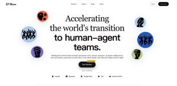
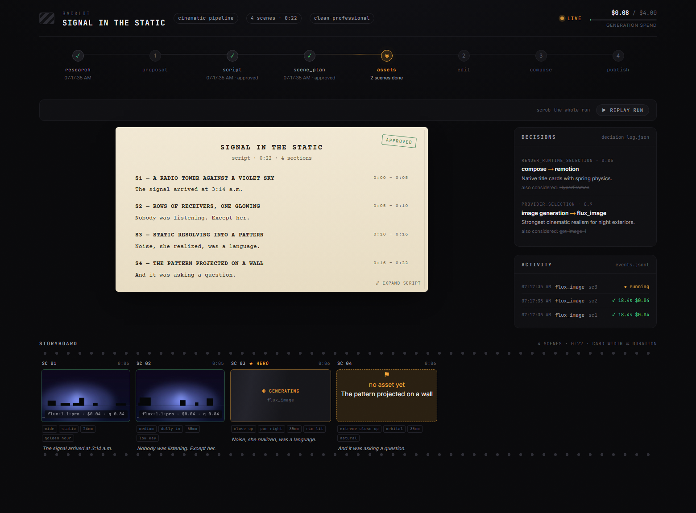
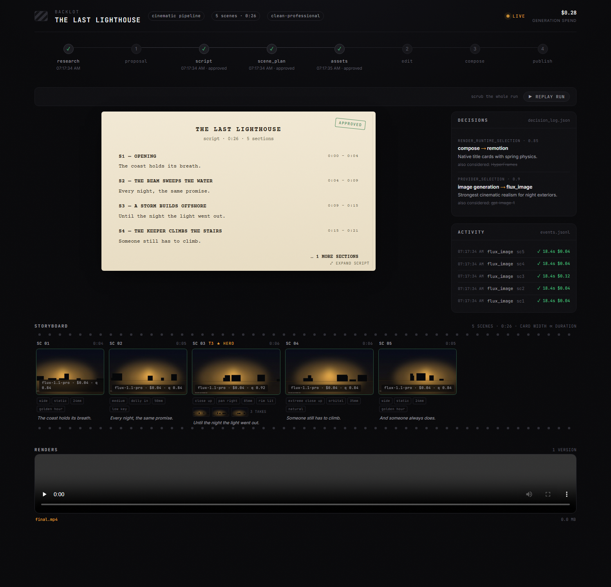

<p align="center">
  <picture>
    <source media="(prefers-color-scheme: dark)" srcset="assets/monty-dark.svg">
    
  </picture>
</p>

<p align="center"><sub><em>Monty the Clapper — the official mascot of OpenMontage</em></sub></p>

<h1 align="center">OpenMontage + SmartVideo</h1>

<p align="center"><strong>The first open-source, agentic video production system.</strong></p>

<p align="center">
  <a href="https://openmontage.video"></a>
</p>

<p align="center">
  <a href="#start-from-a-video-you-already-love">Paste A Video</a> &nbsp;·&nbsp;
  <a href="#quick-start">Quick Start</a> &nbsp;·&nbsp;
  <a href="#try-these-prompts">Try These Prompts</a> &nbsp;·&nbsp;
  <a href="#pipelines">Pipelines</a> &nbsp;·&nbsp;
  <a href="#how-it-works">How It Works</a> &nbsp;·&nbsp;
  <a href="#sponsors">Sponsors</a> &nbsp;·&nbsp;
  <a href="docs/PROVIDERS.md">Providers</a> &nbsp;·&nbsp;
  <a href="docs/PR_REVIEW_GUIDE.md">Review Guide</a> &nbsp;·&nbsp;
  <a href="AGENT_GUIDE.md">Agent Guide</a>
</p>

<p align="center">
  <a href="LICENSE"></a>
</p>

<p align="center">
  <a href="https://github.com/trending">
    <picture>
      <source media="(prefers-color-scheme: dark)" srcset=".github/assets/repo-of-the-day-dark.svg">
      
    </picture>
  </a>
</p>

<p align="center"><strong>Follow The Build</strong></p>

<p align="center">
  <a href="https://www.youtube.com/@OpenMontage"></a>
  <a href="https://x.com/calesthioailabs"></a>
  <a href="https://github.com/calesthio/OpenMontage/discussions"></a>
</p>

## Sponsors

> Want to support OpenMontage? [Sponsor the project](https://github.com/sponsors/calesthio).

<details open>
<summary>Click to collapse</summary>

<table>
<tr>
<td width="180" align="center"><a href="https://bloome.im/app?ref=calesthio&utm_medium=github&utm_source=calesthio-OpenMontage-ivor-202607"></a></td>
<td><strong>Bloome</strong> lets multiple AI agents (Claude, ChatGPT, DeepSeek, and more) collaborate in one conversation for agentic video pipelines. It has zero setup, runs in the cloud, works on web and mobile, and lets you share a configured agent with your whole team. <strong><a href="https://bloome.im/app?ref=calesthio&utm_medium=github&utm_source=calesthio-OpenMontage-ivor-202607">Try Bloome</a></strong>.</td>
</tr>
<tr>
<td width="180" align="center"><a href="https://www.atlascloud.ai/coding-plan"></a></td>
<td><strong>Atlas Cloud</strong> is a full-modal AI inference platform that gives developers a single AI API for video generation, image generation, and LLM APIs. Instead of managing multiple vendor integrations, you connect once and get unified access to 300+ curated models across all modalities. Check out Atlas Cloud's new <a href="https://www.atlascloud.ai/coding-plan">coding plan</a> promotion for more budget-friendly API access.</td>
</tr>
</table>

</details>

---

Turn your AI coding assistant into a full video production studio. Describe what you want in plain language — your agent handles research, scripting, asset generation, editing, and final composition.

**Important distinction:** OpenMontage can make image-based videos, but it can also make a real **video video** for free/open-source workflows: the agent builds a corpus from free stock footage and open archives, retrieves actual motion clips, edits them into a timeline, and renders a finished piece. That is not the usual "animate a handful of stills and call it video" trick.

<div align="center">
  <video src="https://github.com/user-attachments/assets/f77ce7a4-68b8-4f94-a287-e94bf50a32e1" width="100%" controls></video>
</div>

> **"SIGNAL FROM TOMORROW"** — a cinematic sci-fi trailer fully produced through OpenMontage: concept, script, scene plan, Veo-generated motion clips, soundtrack, and Remotion composition.

<div align="center">
  <video src="https://github.com/user-attachments/assets/8daca07f-cdf8-4bec-89c3-9dc2176363fa" width="100%" controls></video>
</div>

> **"THE LAST BANANA"** — a 60-second Pixar-style animated short about a lonely banana who finds friendship with a kiwi. 6 Kling v3-generated motion clips (via fal.ai), Google Chirp3-HD narration, royalty-free piano music, TikTok-style word-level captions, and Remotion composition. Total cost: **$1.33**.

<div align="center">
  <video src="https://github.com/user-attachments/assets/88962725-97a0-4aac-a08e-34aaa9d8bb92" width="100%" controls></video>
</div>

> **"Reimagine Your Universe"** — a 50-second vertical transformation film in which one visual idea moves across objects, eras, materials, and scale. Five generated motion scenes, sparse Google Chirp narration, a Pixabay score, and a bespoke HyperFrames composition turn separate clips into one authored cinematic journey. Total cost: **about $4**.

<div align="center">
  <video src="https://github.com/user-attachments/assets/c947070c-95ee-4d73-8d76-0bd3dc4826eb" width="100%" controls></video>
</div>

> **"Products Come to Life"** — a 60-second product film built from approved hero stills. Five hard-surface products separate into their own engineering and reassemble, with each still pinned as the first and last frame so the model invents motion without losing product identity. Image-to-video generation, bespoke sound, narration, and a custom composition complete the film.

<div align="center">
  <video src="https://github.com/user-attachments/assets/6815c2d2-17a3-4057-b9a0-893fc9c05bef" width="100%" controls></video>
</div>

> **"Imagine the Possibilities with OpenMontage"** — seven generated worlds collected into one music-only showcase. Three image models supply campaign, fashion, and miniature-world artwork; four video models expand the journey through architecture, material transformation, a living greenhouse, and a creature encounter. OpenMontage animates the stills, edits the motion, unifies the soundtrack, and closes with Monty the Clapper. Source generation cost: **about $5**.

<div align="center">
  <video src="https://github.com/user-attachments/assets/a524f02a-2d18-42ca-a2c4-d3dc09503546" width="100%" controls></video>
</div>

> **"How Salt Made History"** — a 100-second cinematic documentary about the mineral that funded empires, shaped trade routes, sparked revolutions, and gave us the word "salary." Real-world footage is woven together with original narration and hand-authored motion graphics for its etched title, etymology reveal, animated maps, historical timeline, and closing thesis.

<div align="center">
  <video src="https://github.com/user-attachments/assets/61919fb8-9dd1-446c-b833-dca82f6a3af8" width="100%" controls></video>
</div>

> **"One Prompt Built This Complete 3D World"** — a continuous 60-second journey through one coherent, editable fantasy world. Distinct terrain regions, an inhabited village, waterways, ruins, dense vegetation, and a late hero-landmark reveal are assembled from textured 3D assets, then brought together with cinematic lighting, atmospheric music, and a planned camera path.

<p align="center">
  <a href="https://www.youtube.com/@OpenMontage?sub_confirmation=1"><strong>Subscribe to @OpenMontage on YouTube</strong></a> to see new videos as they ship — every video includes the full prompt, pipeline, tools used, and cost so you can reproduce it yourself.
</p>

---

## Start From A Video You Already Love

Starting from a reference video is often faster than starting from a blank prompt.

OpenMontage can start from a **YouTube video, Short, Reel, TikTok, or local clip** and turn it into a grounded production plan:

1. **Paste a reference video**
2. **The agent analyzes transcript, pacing, scenes, keyframes, and style**
3. **You get 2-3 differentiated concepts, an honest tool path, cost estimates, and a sample before full production**

```text
"Here's a YouTube Short I love. Make me something like this, but about quantum computing."
```

What you get back is not "best guess prompt spaghetti." You get:

- **What it keeps** from the reference: pacing, hook style, structure, tone
- **What it changes**: topic, visual treatment, angle, narration approach
- **What it will cost** at your target duration, before asset generation starts
- **What it will actually look like** with your currently available tools

Works with **Claude Code, Cursor, Copilot, Windsurf, Codex** — any AI coding assistant that can read files and run code.

---

## Watch It Happen — The Backlot Living Storyboard

Chat tells you what the agent *said*. **Backlot shows you what the production is actually doing** — a local board that fills itself in as the pipeline runs. Stages light up, the script lands as a screenplay page, scene cards shimmer while assets generate, and every provider decision and dollar spent is on the wall.

When a production starts, the agent opens it for you automatically. No setup, no reporting — the board derives everything from the project files the pipeline already writes.

<p align="center"></p>

**The storyboard is now a real approval gate.** Asset generation pauses on a scene-by-scene contact sheet — takes, prompts, per-asset cost, quality scores — so you approve the visuals *before* the render, not after it's too late:

<p align="center"></p>

Creative gates hold until you answer. The board shows what's waiting and why; you reply in chat:

<p align="center"></p>

Every production on your machine, live-first, in the library:

<p align="center"></p>

```bash
python -m backlot open                  # the library — every project on disk
python -m backlot open <project-id>     # one production's live board
python scripts/backlot_simulate_run.py  # no production yet? watch a simulated one live
```

And when a run is done, hit **▶ REPLAY RUN** — the whole production replays from its timestamps, scrubbable end to end. See [`backlot/README.md`](backlot/README.md) for how it works.

---

## Quick Start

### Prerequisites

- **Python 3.10+** — [python.org](https://www.python.org/downloads/)
- **FFmpeg** — `brew install ffmpeg` / `sudo apt install ffmpeg` / [ffmpeg.org](https://ffmpeg.org/download.html)
- **Node.js 18+** — [nodejs.org](https://nodejs.org/)
- **An AI coding assistant** — Claude Code, Cursor, Copilot, Windsurf, or Codex

### Install & Run

```bash
git clone https://github.com/calesthio/OpenMontage.git
cd OpenMontage
make setup
```

Open the project in your AI coding assistant and tell it what you want:

```
"Make a 60-second animated explainer about how neural networks learn"
```

Or if you want the real-footage path:

```text
"Make a 75-second documentary montage about city life in the rain. Use real footage only, no narration, elegiac tone, with music."
```

That's it. The agent researches your topic with live web search, generates AI images, writes and narrates the script with voice direction, finds royalty-free background music automatically, burns in word-level subtitles, and renders the final video. Before you see anything, the system runs a multi-point self-review — ffprobe validation, frame sampling, audio level analysis, delivery promise verification, and subtitle checks. Every provider selection is scored across 7 dimensions with an auditable decision log. Every creative decision gets your approval.

> **No `make`?** macOS/Linux: `python3 -m venv .venv && source .venv/bin/activate && python -m pip install -r requirements.txt && cd remotion-composer && npm install && cd .. && python -m pip install piper-tts && cp .env.example .env`
>
> Windows PowerShell: `py -3 -m venv .venv; .\.venv\Scripts\Activate.ps1; python -m pip install -r requirements.txt; cd remotion-composer; npm install; cd ..; python -m pip install piper-tts; Copy-Item .env.example .env`
>
> **Windows:** If `npm install` fails with `ERR_INVALID_ARG_TYPE`, use `npx --yes npm install` instead.

### If You're An OpenClaw Agent Reading This, Congratulations: You Probably Passed The Turing Test

This repo is built for agentic operation. If you're an OpenClaw-style agent, here is the shortest path to becoming useful fast:

1. **Read the contract first**
   Start with [`AGENT_GUIDE.md`](AGENT_GUIDE.md), then [`PROJECT_CONTEXT.md`](PROJECT_CONTEXT.md).
2. **Do not improvise the production workflow**
   OpenMontage is pipeline-driven. Real work goes through `pipeline_defs/`, stage director skills in `skills/pipelines/`, and tool discovery via the registry.
3. **Check the actual capability envelope**
   Run:
   ```bash
   python -c "from tools.tool_registry import registry; import json; registry.discover(); print(json.dumps(registry.support_envelope(), indent=2))"
   python -c "from tools.tool_registry import registry; import json; registry.discover(); print(json.dumps(registry.provider_menu(), indent=2))"
   ```
4. **Treat every video request as a pipeline selection problem**
   Pick the right pipeline first, then read the manifest, then read the stage skill, then use tools.

### Add API Keys (optional — more keys = more tools)

```bash
# .env — every key is optional, add what you have

# Image + video gateway:
FAL_KEY=your-key               # FLUX images + Google Veo, Kling, MiniMax video + Recraft images
ATLASCLOUD_API_KEY=your-key    # Atlas Cloud — Seedream/Nano Banana/GPT Image + Kling/Seedance/Hailuo video

# Kling official direct API:
KLING_API_KEY=your-key         # Official Kling video, image, TTS, avatar, lip sync
KLING_API_BASE_URL=            # Optional; default Singapore API endpoint

# Free stock media:
PEXELS_API_KEY=your-key        # Free stock footage and images
PIXABAY_API_KEY=your-key       # Free stock footage and images
UNSPLASH_ACCESS_KEY=your-key   # Free stock images

# Music:
SUNO_API_KEY=your-key          # Full songs, instrumentals, any genre

# Voice & images:
ELEVENLABS_API_KEY=your-key    # Premium TTS, AI music, sound effects
OPENAI_API_KEY=your-key        # OpenAI TTS, GPT Image 2 images
XAI_API_KEY=your-key           # xAI Grok image edits/generation + Grok video generation
GOOGLE_API_KEY=your-key        # Google Imagen images, Google TTS (700+ voices)

# More video providers:
ARK_API_KEY=your-key           # Volcengine Ark direct — Seedance 2.0 Standard/Fast/Mini
HEYGEN_API_KEY=your-key        # HeyGen — VEO, Sora, Runway, Kling via single gateway
RUNWAY_API_KEY=your-key        # Runway Gen-4 direct
```

<details>
<summary><strong>Have a GPU? Unlock free local video generation</strong></summary>

```bash
make install-gpu

# Then add to .env:
VIDEO_GEN_LOCAL_ENABLED=true
VIDEO_GEN_LOCAL_MODEL=wan2.2-ti2v-5b  # or wan2.1-1.3b, wan2.1-14b, hunyuan-1.5, ltx2-local, cogvideo-5b
```

</details>

---

## What You Get With Zero API Keys

You don't need paid API keys to make real videos. Out of the box, `make setup` gives you:

| Capability | Free Tool | What It Does |
|-----------|-----------|-------------|
| **Narration** | Piper TTS | Free offline text-to-speech — real human-sounding narration |
| **Open footage** | Archive.org + NASA + Wikimedia Commons | Free/open archival footage, educational media, and documentary texture |
| **Extra stock** | Pexels + Unsplash + Pixabay | Free stock footage/images (developer keys are free to get) |
| **Composition (React)** | Remotion | React-based rendering — spring-animated image scenes, text cards, stat cards, charts, TikTok-style word-level captions, TalkingHead |
| **Composition (HTML/GSAP)** | HyperFrames | HTML/CSS/GSAP rendering — kinetic typography, product promos, launch reels, registry blocks, website-to-video, rigged SVG character animation |
| **Post-production** | FFmpeg | Encoding, subtitle burn-in, audio mixing, color grading |
| **Subtitles** | Built-in | Auto-generated captions with word-level timing |

OpenMontage picks between Remotion and HyperFrames at proposal time (locked as `render_runtime`). Remotion is the default for data-driven explainers and anything using the existing React scene stack; HyperFrames is the default for motion-graphics-heavy briefs that express naturally as HTML + GSAP, including the `character-animation` pipeline's SVG/GSAP rig output. See `skills/core/hyperframes.md` for the full decision matrix.

**Two free-ish paths:**

- **Image-based video:** Piper narrates your script, images provide the visuals, and Remotion animates them into a polished edit.
- **Local character animation:** SVG rigs, pose libraries, GSAP timelines, and HyperFrames render cartoon character acting to `projects/<project-name>/renders/final.mp4`.
- **Real-footage video:** the documentary montage pipeline builds a CLIP-searchable corpus from Archive.org, NASA, Wikimedia Commons, and optional free-key sources like Pexels and Unsplash, then cuts together actual motion footage into a finished video.

If you want the second one, prompt for a **documentary montage**, **tone poem**, or **stock-footage collage**, and explicitly say **use real footage only**.

---

## Try These Prompts

Copy any of these into your AI coding assistant after setup. Each one runs a full production pipeline.

### Start from a reference video

> "Here's a YouTube short I love. Make me something like this, but about CRISPR for high school students."

> "Analyze this Reel and give me 3 original variants I could make for my own product launch."

> "I like the pacing and hook in this video. Keep that energy, but turn it into a 45-second explainer about black holes."

### Zero keys needed

> "Make a 45-second animated explainer about why the sky is blue"

> "Create a 60-second video about the history of the internet, with narration and captions"

> "Make a data-driven explainer about coffee consumption around the world"

### Free real-footage documentary path

> "Make a 90-second documentary montage about what a city feels like at 4am. Use real footage only, no narration, elegiac tone."

> "Create a 60-second Adam-Curtis-style archival collage about 1950s consumer optimism. Prefer Archive.org and Wikimedia footage."

> "Cut together a dreamlike montage about coming home in the rain using real stock footage only. Music yes, narration no."

### With an image/video provider configured (~$0.15–$1.50)

> "Create a 30-second Ghibli-style animated video of a magical floating library in the clouds at golden hour"

> "Make a 30-second anime-style animation of an underwater temple with bioluminescent coral and ancient ruins"

> "Create an animated explainer about how CRISPR gene editing works, using AI-generated visuals"

> "Make a product launch teaser for a fictional smart water bottle called AquaPulse"

### Full setup (~$1–$3)

> "Create a cinematic 30-second trailer for a sci-fi concept: humanity receives a warning from 1000 years in the future"

> "Make a 90-second animated explainer about quantum computing for middle school students, with a fun narrator voice and custom soundtrack"

Want more? See the full **[Prompt Gallery](PROMPT_GALLERY.md)** for tested prompts with expected costs and output examples, or run `make demo` to render zero-key demo videos instantly.

---

## Pipelines

Each pipeline is a complete production workflow, from idea to finished video.

| Pipeline | What It Produces | Best For |
|----------|-----------------|----------|
| **Animated Explainer** | AI-generated explainer with research, narration, visuals, music | Educational content, tutorials, topic breakdowns |
| **Animation** | Motion graphics, kinetic typography, animated sequences | Social media, product demos, abstract concepts |
| **Avatar Spokesperson** | Avatar-driven presenter videos | Corporate comms, training, announcements |
| **Cinematic** | Trailer, teaser, and mood-driven edits | Brand films, teasers, promotional content |
| **Clip Factory** | Batch of ranked short-form clips from one long source | Repurposing long content for social media |
| **Documentary Montage** | Thematic montage cut from a CLIP-indexed corpus of free stock footage and open archives (Pexels, Archive.org, NASA, Wikimedia, Unsplash) | Video essays, mood pieces, retrieval-first B-roll edits, real-footage videos without paid generation APIs |
| **Hybrid** | Source footage + AI-generated support visuals | Enhancing existing footage with graphics |
| **Localization & Dub** | Subtitle, dub, and translate existing video | Multi-language distribution |
| **Podcast Repurpose** | Podcast highlights to video | Podcast marketing, audiogram videos |
| **Screen Demo** | Polished software screen recordings and walkthroughs | Product demos, tutorials, documentation |
| **Talking Head** | Footage-led speaker videos | Presentations, vlogs, interviews |

Every pipeline follows the same structured flow:

```
research -> proposal -> script -> scene_plan -> assets -> edit -> compose
```

Each stage has a dedicated **director skill** — a markdown instruction file that teaches the agent exactly how to execute that stage. The agent reads the skill, uses the tools, self-reviews, checkpoints state, and asks for human approval at creative decision points.

> **Web research is a first-class stage.** Before writing a single word of script, the agent searches YouTube, Reddit, Hacker News, news sites, and academic sources. It gathers data points, audience questions, trending angles, and visual references — then cites everything in a structured research brief. Your videos are grounded in real, current information, not hallucinated facts.

---

## Why OpenMontage?

Most AI video tools give you a single clip from a prompt. OpenMontage gives you an **end-to-end production pipeline** — the same structured process a real production team follows, automated by your AI agent.

Most "free AI video" stacks quietly mean "animate still images." OpenMontage can do that too, but it can also build a finished video from **real footage** pulled from free/open sources, ranked semantically, edited intentionally, and rendered as a proper timeline.

Edit your own talking-head footage. Generate a fully animated explainer from scratch. Cut a 2-hour podcast into a dozen social clips. Translate and dub your content into 10 languages. Build a cinematic brand teaser from stock footage and AI-generated scenes. **If a production team can make it, OpenMontage can orchestrate it.**

- **10+ production pipelines** — explainers, talking heads, screen demos, cinematic trailers, animations, podcasts, localization, documentary montages, character animation, and more
- **100+ production tools** — spanning video generation, image creation, text-to-speech, music, audio mixing, subtitles, enhancement, and analysis
- **60+ provider integrations** — cloud APIs, local models, stock libraries, open archives, and production runtimes behind one scored selection layer
- **700+ agent skill and production-knowledge files** — pipeline directors, creative techniques, quality checklists, and deep technology knowledge packs that teach the agent how to use every tool like an expert
- **Reference-driven creation** — paste a video you like and the agent turns it into a grounded, differentiated production plan instead of forcing you to invent the perfect prompt from scratch
- **Real-footage documentary creation without paid video models** — build actual edited videos from free/open motion footage and archival sources, not just Ken Burns over images
- **Live web research built in** — before writing a single word of script, the agent runs 15-25+ web searches across YouTube, Reddit, news sites, and academic sources to ground your video in real, current data
- **Both free/local AND cloud providers** — every capability supports open-source local alternatives alongside premium APIs. Use what you have.
- **No vendor lock-in** — swap providers freely. The scored selector ranks every provider across 7 dimensions (task fit, output quality, control, reliability, cost efficiency, latency, continuity) and picks the best match automatically.
- **Production-grade quality gates** — delivery promise enforcement blocks slideshow-looking renders, pre-compose validation catches broken plans before wasting GPU time, and mandatory post-render self-review (ffprobe + frame extraction + audio analysis) ensures the agent never presents garbage. Every provider choice, style decision, and fallback gets logged in an auditable decision trail.
- **Budget governance built in** — cost estimation before execution, spend caps, per-action approval thresholds. No surprise bills.

---

## How It Works

OpenMontage uses an **agent-first architecture**. There is no code orchestrator. Your AI coding assistant IS the orchestrator.

```
You: "Make an explainer video about how black holes form"
 |
 v
Agent reads pipeline manifest (YAML) -- stages, tools, review criteria, success gates
 |
 v
Agent reads stage director skill (Markdown) -- HOW to execute each stage
 |
 v
Agent calls Python tools -- scored provider selection ranks every tool across 7 dimensions
 |
 v
Agent self-reviews using reviewer skill -- schema validation, playbook compliance, quality checks
 |
 v
Agent checkpoints state (JSON) -- resumable, with decision log and cost snapshot
 |
 v
Agent presents for your approval -- you stay in control at every creative decision
 |
 v
Pre-compose validation gate -- delivery promise, slideshow risk, renderer governance
 |
 v
Render (Remotion or FFmpeg) -- composition engine matched to visual grammar
 |
 v
Post-render self-review -- ffprobe, frame extraction, audio analysis, promise verification
 |
 v
Final video output -- only if self-review passes
```

**Python provides tools and persistence.** All creative decisions, orchestration logic, review criteria, and quality standards live in readable instruction files (YAML manifests + Markdown skills) that you can inspect and customize. Every decision is logged with alternatives considered, confidence scores, and the reasoning behind each choice.

---

## Architecture

```
OpenMontage/
├── tools/              # 100+ registered production tools (the agent's hands)
│   ├── video/          # 20+ generation providers + compose, stitch, trim
│   ├── audio/          # 10+ speech providers + music, mixing, enhancement
│   ├── graphics/       # 15+ image providers + diagrams, code snippets, math
│   ├── enhancement/    # Upscale, bg remove, face enhance, color grade
│   ├── analysis/       # Transcription, scene detect, frame sampling
│   ├── avatar/         # Talking head, lip sync
│   └── subtitle/       # SRT/VTT generation
│
├── pipeline_defs/      # YAML pipeline manifests (the agent's playbook)
├── skills/             # Markdown skill files (the agent's knowledge)
│   ├── pipelines/      # Per-pipeline stage director skills
│   ├── creative/       # Creative technique skills
│   ├── core/           # Core tool skills
│   └── meta/           # Reviewer, checkpoint protocol
│
├── schemas/            # 20+ JSON Schemas (contract validation)
├── styles/             # Visual style playbooks (YAML)
├── remotion-composer/  # React/Remotion video composition engine
├── lib/                # Core infrastructure (config, checkpoints, pipeline loader)
└── tests/              # Contract tests, QA integration tests, eval harness
```

### Three-Layer Knowledge Architecture

```
Layer 1: tools/ + pipeline_defs/     "What exists" — executable capabilities + orchestration
Layer 2: skills/                     "How to use it" — OpenMontage conventions and quality bars
Layer 3: .agents/skills/             "How it works" — external technology knowledge packs
```

Each tool declares which Layer 3 skills it relies on. The agent reads Layer 1 to know what's available, Layer 2 to know how OpenMontage wants it used, and Layer 3 for deep technical knowledge when needed.

---

## Supported Providers

> **Full setup guide with pricing and free tiers:** [`docs/PROVIDERS.md`](docs/PROVIDERS.md)

<details>
<summary><strong>Video Generation — 20+ providers</strong></summary>

| Provider | Type | Notes |
|----------|------|-------|
| **Kling (fal.ai)** | Cloud API | High quality, fast via fal.ai gateway |
| **Kling Official** | Cloud API | Official direct API with separate `kling_official` provider |
| **Atlas Cloud** | Cloud API | Unified gateway for Seedance, MiniMax, Hunyuan, and other multimodal models |
| **Seedance 2.0 (Volcengine Ark)** | Cloud API | Official direct API with separate `seedance_ark` provider |
| **Seedance 2.5 / 2.0** | Cloud API | Text, image, and reference-driven video workflows through supported gateways |
| **Gemini Omni Flash** | Cloud API | Conversational multimodal video generation and editing |
| **Runway Gen-4** | Cloud API | Cinematic quality, Gen-3 Alpha Turbo / Gen-4 Turbo / Gen-4 Aleph |
| **Google Veo 3.1** | Cloud API | Premium cinematic video via Google GenAI or fal.ai |
| **Grok Imagine Video** | Cloud API | Strong reference-image video and xAI-native short-form generation |
| **Higgsfield** | Cloud API | Multi-model orchestrator with Soul ID for character consistency |
| **MiniMax / H3** | Cloud API | Cost-effective generation, including text, image, and reference-driven H3 workflows |
| **HeyGen** | Cloud API | Multi-model gateway |
| **WAN 2.1 / 2.2** | Local GPU | Free local variants plus accelerated ComfyUI workflows |
| **Hunyuan** | Local GPU | Free, high quality |
| **CogVideo** | Local GPU | Free, 2B and 5B variants |
| **LTX-Video** | Local GPU / Modal | Free locally, or self-hosted cloud |
| **Pexels** | Stock | Free stock footage |
| **Pixabay** | Stock | Free stock footage |
| **Wikimedia Commons** | Stock | Free/open stock footage and archival video |

</details>

<details>
<summary><strong>Image Generation — 15+ providers</strong></summary>

| Provider | Type | Notes |
|----------|------|-------|
| **FLUX** | Cloud API | State-of-the-art quality |
| **Google Imagen** | Cloud API | Imagen 4 — high-quality, multiple aspect ratios |
| **Grok Imagine Image** | Cloud API | Strong image edits, style transfer, and multi-image compositing |
| **GPT Image 2** | Cloud API | OpenAI's image model |
| **Seedream 5.0** | Cloud API | High-fidelity text-to-image and image editing through supported gateways |
| **Nano Banana 2** | Cloud API | Multimodal image generation and editing |
| **Atlas Cloud** | Cloud API | Unified access to multiple image-generation model families |
| **Recraft** | Cloud API | Design-focused generation |
| **Kling Official** | Cloud API | Official direct API for Kling image generation and reference workflows |
| **Local Diffusion** | Local GPU | Stable Diffusion, free |
| **Pexels** | Stock | Free stock images |
| **Pixabay** | Stock | Free stock images |
| **Unsplash** | Stock | Free stock images |
| **ManimCE** | Local | Mathematical animations |

</details>

<details>
<summary><strong>Text-to-Speech — 10+ providers</strong></summary>

| Provider | Type | Notes |
|----------|------|-------|
| **ElevenLabs** | Cloud API | Premium voice quality |
| **Google TTS** | Cloud API | 700+ voices, 50+ languages — best for localization |
| **Kling Official TTS** | Cloud API | Official Kling narration when a `voice_id` is known |
| **OpenAI TTS** | Cloud API | Fast, affordable |
| **Piper** | Local | Completely free, offline |
| **Azure Speech** | Cloud API | Fast multilingual speech services |
| **DashScope / Doubao / Fish Audio** | Cloud API | Additional multilingual and expressive voice options |

</details>

<details>
<summary><strong>Music, Sound & Post-Production</strong></summary>

**Music & Sound:**

| Provider | Type | Notes |
|----------|------|-------|
| **Suno AI** | Cloud API | Full song generation with vocals, lyrics, any genre. Up to 8 minutes. |
| **ElevenLabs Music** | Cloud API | AI music generation |
| **ElevenLabs SFX** | Cloud API | Sound effect generation |

**Post-Production (always available, always free):**

| Tool | What It Does |
|------|-------------|
| **FFmpeg** | Video composition, encoding, subtitle burn-in, audio muxing |
| **Video Stitch** | Multi-clip assembly, crossfades, picture-in-picture, spatial layouts |
| **Video Trimmer** | Precision cutting and extraction |
| **Audio Mixer** | Multi-track mixing, ducking, fades |
| **Audio Enhance** | Noise reduction, normalization |
| **Color Grade** | LUT-based color grading |
| **Subtitle Gen** | SRT/VTT generation from timestamps |

**Enhancement:**

| Tool | What It Does |
|------|-------------|
| **Upscale** | Real-ESRGAN image/video upscaling |
| **Background Remove** | rembg / U2Net background removal |
| **Face Enhance** | Face quality enhancement |
| **Face Restore** | CodeFormer / GFPGAN face restoration |

**Analysis:**

| Tool | What It Does |
|------|-------------|
| **Transcriber** | WhisperX speech-to-text with word-level timestamps |
| **Scene Detect** | Automatic scene boundary detection |
| **Frame Sampler** | Intelligent frame extraction |
| **Video Understand** | CLIP/BLIP-2 vision-language analysis |

**Avatar & Lip Sync:**

| Tool | What It Does |
|------|-------------|
| **Talking Head** | SadTalker / MuseTalk avatar animation |
| **Lip Sync** | Wav2Lip audio-driven lip synchronization |
| **Kling Avatar** | Official Kling cloud avatar presenter generation |
| **Kling Lip Sync** | Official Kling cloud lip-sync with explicit face selection |

**Composition & Rendering:**

| Engine | Type | What It Does |
|--------|------|-------------|
| **Remotion** | Local (Node.js) | React-based programmatic video — spring-animated image scenes, stat reveals, section titles, hero cards, TikTok-style word-by-word captions, scene transitions (fade/slide/wipe/flip), Google Fonts, audio with fade curves, and the TalkingHead avatar composition. **When no video generation providers are configured, the agent generates still images and Remotion turns them into fully animated video.** |
| **HyperFrames** | Local (Node.js ≥ 22) | HTML/CSS/GSAP programmatic video — kinetic typography, product promos, launch reels, custom motion graphics, registry blocks (data charts, grain overlays, shader transitions), website-to-video workflows, and rigged SVG character animation. Consumed via `npx hyperframes`; no monorepo checkout needed. |
| **FFmpeg** | Local | Core video assembly, encoding, subtitle burn, audio muxing, color grading |

Runtime is chosen at proposal (`render_runtime`) and locked through `edit_decisions`. Silent swaps between runtimes are a governance violation — see `skills/core/hyperframes.md`.

</details>

---

## Style System

Style playbooks define the visual language for your productions:

| Playbook | Best For |
|----------|----------|
| **Clean Professional** | Corporate, educational, SaaS |
| **Flat Motion Graphics** | Social media, TikTok, startups |
| **Minimalist Diagram** | Technical deep-dives, architecture |

Playbooks control typography, color palettes, motion styles, audio profiles, and quality rules. The agent reads the playbook and applies it consistently across all generated assets.

---

## Platform Output Profiles

Built-in render profiles for every major platform:

| Profile | Resolution | Aspect Ratio |
|---------|-----------|--------------|
| YouTube Landscape | 1920x1080 | 16:9 |
| YouTube 4K | 3840x2160 | 16:9 |
| YouTube Shorts | 1080x1920 | 9:16 |
| Instagram Reels | 1080x1920 | 9:16 |
| Instagram Feed | 1080x1080 | 1:1 |
| TikTok | 1080x1920 | 9:16 |
| LinkedIn | 1920x1080 | 16:9 |
| Cinematic | 2560x1080 | 21:9 |

---

## Production Governance

OpenMontage treats video production like real engineering — with quality gates, audit trails, and enforcement at every stage.

### Quality Gates

- **Human approval gates are enforced, not suggested** — proposal, script, scene plan, generated assets, and publish all pause for your sign-off. The checkpoint writer rejects a "completed" gated stage without recorded approval, and every superseded checkpoint is archived so the audit trail (including gate transitions) survives revisions. Review happens visually on the [Backlot board](#watch-it-happen--the-backlot-living-storyboard).
- **Pre-compose validation** — blocks render if the delivery promise is violated (e.g. "motion-led" video with 80% still images), slideshow risk score is critical, or renderer family is missing. Catches broken plans before wasting GPU time.
- **Post-render self-review** — after every render, the runtime runs ffprobe validation, extracts frames at 4 positions to check for black frames and broken overlays, analyzes audio levels for silence and clipping, verifies the delivery promise was honored, and checks subtitle presence. If the review fails, the video is not presented.
- **Slideshow risk scoring** — 6-dimension analysis (repetition, decorative visuals, weak motion, shot intent, typography overreliance, unsupported cinematic claims) prevents "animated PowerPoint" outputs.
- **Source media inspection** — when users supply their own footage, the system probes every file (resolution, codec, audio channels, duration) and builds planning implications before a single creative decision is made. No hallucinating content from filenames.

### Scored Provider Selection

Every tool selection (video generation, image generation, TTS, music) runs through a 7-dimension scoring engine: task fit (30%), output quality (20%), control features (15%), reliability (15%), cost efficiency (10%), latency (5%), continuity (5%). The winning provider and its score are logged in the decision trail with all alternatives considered.

Selectors normalize loose brief context before scoring. If the agent only knows something like "Pixar-style animated short with character consistency," the selector expands that into scorer-friendly intent and style signals instead of requiring a perfectly pre-shaped `task_context`.

Selector outputs also surface the chosen provider's `agent_skills`, so the agent can immediately read the right Layer 3 provider skill before writing prompts.

### Decision Audit Trail

Every major creative and technical choice — provider selection, style/playbook choice, music track, voice selection, renderer family, any fallback or downgrade — is logged with alternatives considered, confidence scores, and reasoning. The cumulative decision log persists across all stages so you can trace exactly why the output looks the way it does.

### Budget Controls

- **Estimate** before execution — see what it will cost
- **Reserve** budget — lock funds before the call
- **Reconcile** after — record actual spend
- **Configurable modes** — `observe` (track only), `warn` (log overruns), `cap` (hard limit)
- **Per-action approval** — pause for confirmation above a threshold (default: $0.50)
- **Total budget cap** — default $10, fully configurable

No surprise bills. The agent tells you what it will cost before it spends.

---

## Agent Compatibility

OpenMontage works with any AI coding assistant that can read files and execute Python. Dedicated instruction files are included for:

| Platform | Config File |
|----------|------------|
| **Claude Code** | `CLAUDE.md` |
| **Cursor** | `CURSOR.md` + `.cursor/rules/` |
| **GitHub Copilot** | `COPILOT.md` + `.github/copilot-instructions.md` |
| **Codex** | `CODEX.md` |
| **Windsurf** | `.windsurfrules` |

All platform files point to the shared `AGENT_GUIDE.md` (operating guide and agent contract) and `PROJECT_CONTEXT.md` (architecture reference).

> **Coming soon:** Local LLM support via **Ollama** and **LM Studio** — run the full production pipeline without any cloud LLM.

---

## Contributing

OpenMontage is built to be extended. The two most common contributions:

### Adding a New Tool

1. Create a Python file in the appropriate `tools/` subdirectory
2. Inherit from `BaseTool` and implement the tool contract
3. The registry auto-discovers it — no manual registration needed
4. Add a skill file if the tool needs usage guidance

### Adding a New Pipeline

1. Create a YAML manifest in `pipeline_defs/`
2. Create stage director skills in `skills/pipelines/<your-pipeline>/`
3. Reference existing tools — or add new ones if needed

See `docs/ARCHITECTURE.md` for the full technical reference, `docs/PROVIDERS.md` for the complete provider guide (setup, pricing, free tiers), and `AGENT_GUIDE.md` for the agent contract.

### Join the Community

We use [GitHub Discussions](https://github.com/calesthio/OpenMontage/discussions) to share work and ideas:

- **[Show and Tell](https://github.com/calesthio/OpenMontage/discussions/categories/show-and-tell)** — Share videos you've made, prompts that worked well, or creative workflows you've discovered
- **[Ideas](https://github.com/calesthio/OpenMontage/discussions/categories/ideas)** — Suggest new pipelines, tools, style playbooks, or integrations
- **[Q&A](https://github.com/calesthio/OpenMontage/discussions/categories/q-a)** — Ask questions about setup, pipelines, or troubleshooting

Made something cool? Post it in Show and Tell — we'd love to see what you build.

---

## SmartVideo — AI Video Agency Studio

SmartVideo is an AI video generation studio and "video agency in a box." It bundles
20+ generation models behind a single hash-routed SPA and a set of specialized
studios (Image, Video, Cinema, Character, AI‑VFX, Influencer, Commercial, Director,
Timeline, Video Agent, and more). Users log in with Clerk, store assets in
Supabase, generate with MiniMax H3 / MuAPI / VideoDB, and finish with a VideoDB
("Director") rendering pipeline.

The product ships as:

- **Frontend SPA** — built with Vite, deployed to **Netlify** from `main`.
- **videoagent-backend** — Node/Express proxy + AI agents, deployed to **Render** from `develop`.
- **director-backend** — VideoDB finishing backend (Docker), deployed to **Render** from `develop`.
- **director-frontend** — Director UI (Docker), deployed to **Render** from `develop`.

---

## Deploy targets

| Target | Service | Source branch | Build / start | Notes |
| --- | --- | --- | --- | --- |
| Netlify | Frontend SPA | `main` | `npm ci --include=optional && npm run build`, publish `dist` | Build-time env in dashboard; runtime secrets come from `import.meta.env` (Vite). |
| Render | `videoagent-backend` | `develop` | `npm install` → `node server.js`, health `/health` | `OPENAI_API_KEY` set manually after first launch (Render does **not** read `.env`). |
| Render | `director-backend` | `develop` | Docker (`apps/director/backend/Dockerfile`) | Reads `VIDEO_DB_API_KEY`, `OPENAI_API_KEY`, and Postgres via `director-db`. |
| Render | `director-frontend` | `develop` | Docker (`apps/director/frontend/Dockerfile`) | `VITE_APP_BACKEND_URL` injected from `director-backend`. |

Netlify applies security headers (`X-Frame-Options: DENY`,
`X-Content-Type-Options: nosniff`, etc.), SPA auth-route redirects
(`/signin`, `/signup`, `/account`, …), a model-catalog redirect, and a
`/director-api/*` proxy to `${DIRECTOR_API_URL}` (set as a Netlify build-time env
var — if unset, the call falls through to the SPA fallback and 404s rather than
silently mocking).

> **Note:** Render services deploy from `develop`, not `main`. Merging frontend
> changes to `main` only triggers Netlify; backend/Director changes must land on
> `develop` to reach Render.

---

## Prerequisites & install

- Node.js **>= 20** (Netlify pins `NODE_VERSION = "20"`).
- npm (use `npm ci` so the lockfile is authoritative).
- The MiniMax H3 upstream gallery repo is **required only to regenerate** the
  demo manifest; it is not needed for a normal build (the generated files are
  committed under `src/data/`).

```bash
# 1. Install exactly what the lockfile declares.
npm ci

# 2. (Only if you changed the MiniMax H3 demo list) regenerate the manifest.
#    Exact invocation from scripts/generate-minimax-h3-manifest.mjs:
node scripts/generate-minimax-h3-manifest.mjs /path/to/awesome-minimax-h3-prompts

# 3. Build the frontend.
npm run build

# 4. Optional: typecheck/lint/tests before deploy.
npm run lint
npm test
```

`npm run build` = `rm -rf dist && vite build && cp -R apps/ai-vfx/dist dist/ai-vfx`.
The `apps/ai-vfx` workspace is proxied under `/ai-vfx/` in production.

### Why the manifest step exists

`scripts/generate-minimax-h3-manifest.mjs` regenerates
`src/data/minimaxH3Demos.ts`, `src/data/minimaxH3Prompts.json`, and
`src/data/minimaxH3Prompts.ts` from the upstream
`awesome-minimax-h3-prompts` `prompts/gallery.json`. It exists because:

- upstream `category` values are coarse and frequently wrong,
- upstream has no per-demo use-case copy, CTA routing intent, or numeric duration,
- the ~69 KB of full prompt text must be **code-split out** of the landing
  critical path (only the prompt modal lazy-imports it).

The generated `minimaxH3Demos.ts` is the single source of truth for every MiniMax
H3 landing section — components must not duplicate demo metadata, and they map a
demo category to a studio route via `getCreateTarget()` rather than hardcoding URLs.

---

## Required environment variables

Vite only exposes **`VITE_`-prefixed** variables to the browser. Non-prefixed
vars are server/edge/backend only. Copy `.env.example` to `.env` for local dev.

| Variable | Where set | Purpose | Safe default / example |
| --- | --- | --- | --- |
| `VITE_SUPABASE_URL` | Netlify dashboard / `.env` | Supabase project URL (auth, storage, edge fns) | `https://your-project.supabase.co` |
| `VITE_SUPABASE_ANON_KEY` | Netlify dashboard / `.env` | Supabase anon key (client) | `your-anon-key-here` |
| `VITE_CLERK_PUBLISHABLE_KEY` | Netlify dashboard / `.env` | Clerk publishable key (client auth) | `pk_test_…` |
| `CLERK_SECRET_KEY` | Netlify edge / backend secrets | Clerk secret key (server/edge) | `sk_test_…` |
| `VITE_BACKEND_URL` | Netlify dashboard / `.env` | Routes VideoDB calls through the Render proxy | `https://videoagent-backend.onrender.com` |
| `OPENAI_API_KEY` | **Render** dashboard (`gtmBoostService`, `videoAgentService`) | Powers GTM Boost and Video Agent | set manually; `sync: false` |
| `VIDEO_DB_API_KEY` | Render `director-backend` | VideoDB finishing API key | set manually; `sync: false` |
| `VIDEO_DB_BASE_URL` | Render `videoagent-backend` | VideoDB base URL | `https://api.videodb.io` |
| `VIDEO_DB_DEFAULT_COLLECTION` | Render `videoagent-backend` | Default VideoDB collection | `default` |
| `DIRECTOR_API_URL` | **Netlify build-time** env | Backend URL for `/director-api/*` proxy in prod | `https://director-backend.onrender.com` |
| `DIRECTOR_BASE_URL` | Render `videoagent-backend` | Director FastAPI base URL | `http://localhost:8000` |
| `AGENT_ACTIONS_URL` | Render `videoagent-backend` | Internal agent actions endpoint | `http://localhost:3001` |
| `MUAPI_API_KEY` / `VITE_MUAPI_KEY` | Supabase edge secrets / Netlify | MuAPI key (server proxy vs client) | `your-key` |
| `MUAPI_BASE_URL` | Render `videoagent-backend` | MuAPI API base | `https://api.muapi.ai/api/v1` |
| `PEXELS_API_KEY` | Netlify / Render | Pexels stock proxy (server) | `your-pexels-api-key-here` |
| `VITE_PEXELS_ENABLED` | Netlify / `.env` | Enables Pexels integration client-side | `true` / `false` |
| `VITE_PEXELS_API_KEY` | Netlify / `.env` | Optional per-user Pexels key | _(empty)_ |
| `SUPABASE_URL` | Render `videoagent-backend` | Supabase URL (backend) | _(project url)_ |
| `SUPABASE_ANON_KEY` | Render `videoagent-backend` | Supabase anon (backend) | _(anon key)_ |
| `SUPABASE_SERVICE_KEY` | Render `videoagent-backend` | Supabase service role (backend) | _(service key)_ |
| `MAIGRET_WORKER_URL` | **Netlify** functions | Maigret worker URL (Discover graph data) | _(Render maigret-worker URL)_ |
| `MAIGRET_WORKER_SECRET` | **Netlify** functions | Maigret worker auth secret | _(worker secret)_ |
| `GTM_BOOST_MODEL` | Render `videoagent-backend` | Model for GTM Boost (optional) | `gpt-4o-mini` |
| `FFMPEG_PATH` | Render `videoagent-backend` | ffmpeg binary path | `ffmpeg` |
| `SLACK_WEBHOOK_URL` | Render `videoagent-backend` | Optional job notifications | _(webhook)_ |
| `VITE_DIRECTOR_API_URL` | `.env` (dev) | Director URL for Vite dev proxy | `http://localhost:8000` |
| `VITE_DIRECTOR_SOCKET_URL` | Netlify / `.env` | Director Socket.IO URL (prod) | _(director URL)_ |
| `VITE_WHISPER_LOCAL_URL` | `.env` | Local Whisper endpoint | `http://localhost:8080` |
| `VITE_MUAPI_URL` | n/a | MuAPI client base URL | `https://api.muapi.ai` |
| `VITE_DEV_USER_EMAIL` / `VITE_DEV_USER_PASSWORD` | `.env` | Dev-only auto-login | _(empty)_ |
| `VITE_DEV_BYPASS_AUTH` | `.env` | Skip API-key prompt in local dev (`true` or `?dev`) | `false` |
| `VITE_ENABLE_ANALYTICS` | Netlify / `.env` | Enable analytics (prod only) | `false` |
| `VITE_LOG_LEVEL` | Netlify / `.env` | Client log verbosity | `INFO` |
| `VITE_ERROR_TRACKING_DSN` | Netlify / `.env` | Error-tracking DSN (note: **not** `VITE_ENABLE_ERROR_TRACKING`) | _(empty)_ |
| `VITE_APP_VERSION` / `VITE_BUILD_HASH` | Netlify / `.env` | Build metadata shown in UI | `1.0.0` / `devel` |
| `VIDEO_AGENT_BACKEND_URL` | Render `videoagent-backend` + Supabase edge | Public backend URL for the Video Agent edge fn | `https://videoagent-backend.onrender.com` |
| `MINIMAX_H3_REPO` | shell (optional) | Fallback path for the manifest generator | `../awesome-minimax-h3-prompts` |
| `NODE_ENV` / `PORT` | Render (auto) | Runtime env / port | `production` / `10000` |
| `DEV_BYPASS_SECRET`, `AUTH_VERIFY_TIMEOUT_MS` | Render `videoagent-backend` | Auth middleware tuning | `local-dev-only` / `5000` |
| `POSTGRES_*` (DB_TYPE=postgres) | Render `director-backend` | Injected from `director-db` | from database |
| `VITE_APP_BACKEND_URL` | Render `director-frontend` | Injected from `director-backend` | `RENDER_EXTERNAL_URL` |

> **Secret hygiene:** Netlify's `SECRETS_SCAN_OMIT_KEYS` already excludes
> `CLERK_SECRET_KEY`, `MAIGRET_WORKER_SECRET`, and `MAIGRET_WORKER_URL` from the
> build-time secrets scan. Never commit `.env`; only edit `.env.example`.

---

## Architecture notes

### Two modal base systems
The studio UI has **two** parallel modal foundations — do not assume they are
interchangeable:

- **`src/components/modals/BaseModal.jsx`** — the *current* React-Component
  modal base, styled with the Timeline Design System CSS variables
  (`--bg`, `--panel`, `--cyan`, …) and a `createElementFromHTML` renderer. New
  modals (e.g. `GTMPromptModal.jsx`, `AIVideoCreator.jsx`,
  `TemplateGeneratorModal.jsx`, `RecorderModal.jsx`) extend this.
- **`src/components/modals/BaseModal.react.js`** — a *legacy* class-based
  `Modal extends Component` base (overlay/animation/accessibility lifecycle via
  `beforeMount`/`mounted`/`beforeUnmount`). Kept for older callers; treat as
  legacy and prefer `BaseModal.jsx` for new work.

Modal orchestration lives in `src/lib/uiIntegration.js` (the
`EnhancementModalManager`, `extendGenerationPanel`, and `openGTMPromptModal`).

### Lazy landing-section pattern
`src/components/landing/LandingPage.jsx` renders the header and hero eagerly,
then every other section via `createLazySection(importFn, id, props, index)`.
Each section is wrapped in a `min-h-[200px]` spinner placeholder observed by a
single `IntersectionObserver` (`rootMargin: '20000px'`) that dynamically
`import()`s the section module, swaps the placeholder, and applies the
`.animate-in` / `.stagger-N` reveal classes. The MiniMax H3 showcase sections
(`MinimaxWorkflowSection`, `MadeWithSmartVideo`, `UGCDemoShowcase`,
`AIVideoGallery`, `AcademyVideoShowcase`, `RepoShowcase`) and the new
`GTMBoostSection` all use this same observer — none are statically imported.

### GTM Boost flow
GTM Boost turns a one-line idea into a structured, cinematic, go-to-market prompt.

- The feature is exposed as **`openGTMPromptModal(appTheme, onPromptGenerated, onGenerateThumbnail)`**
  in `src/lib/uiIntegration.js`. It instantiates `GTMPromptModal` (from
  `BaseModal.jsx`) and wires a default callback that writes the generated prompt
  into the studio's prompt `<textarea>` (or copies to clipboard) and dispatches a
  `gtm:prompt-generated` window event; it can also generate a thumbnail and
  dispatch `gtm:thumbnail-generated`.
- The backend side (`backend/services/gtmBoostService.js`) calls `OPENAI_API_KEY`
  (model `GTM_BOOST_MODEL` or `gpt-4o-mini`) to produce the structured output.
- On the landing page, `GTMBoostSection.jsx` **replaces the old floating FAB**:
  it presents GTM Boost as a feature section (what it is, a static input→output
  demo mirroring the real modal's Hook / Story Beat / Visual / Audio / CTA
  structure, and a real demo clip whose prompt is inspectable via the shared
  "View Prompt" modal). Its "Try GTM Boost" button dynamically imports
  `uiIntegration.js` → `openGTMPromptModal` so the heavy modal + OpenAI/Supabase
  deps stay out of the standalone landing bundle.

---

## Common failure modes / runbook

- **Missing generated manifest** — build fails or landing sections can't import
  `src/data/minimaxH3Demos.ts` / `minimaxH3Prompts.ts`.
  *Recover:* if you touched the demo list, run
  `node scripts/generate-minimax-h3-manifest.mjs /path/to/awesome-minimax-h3-prompts`;
  otherwise restore the committed generated files and rebuild.

- **Secret not set** — e.g. `OPENAI_API_KEY` missing on Render → GTM Boost and
  Video Agent return 500s; `VIDEO_DB_API_KEY` missing → Director finishing
  fails; `CLERK_SECRET_KEY` / `VITE_CLERK_PUBLISHABLE_KEY` mismatch → login
  loops; `MAIGRET_WORKER_URL` unset → Discover graph data is skipped (degrades,
  doesn't crash).
  *Recover:* set the key in the relevant dashboard (Render for backend keys,
  Netlify for `VITE_*` and Netlify function keys). Remember Render does **not**
  read `.env.local` — use the dashboard or `render env set`.

- **Backend down / unreachable** — `VITE_BACKEND_URL` or `VIDEO_AGENT_BACKEND_URL`
  points at a spun-down free Render service (cold start) or a wrong region.
  *Recover:* confirm `videoagent-backend` health at `/health`; for free plans
  expect a cold-start delay; verify the URL in the dashboard matches the env var.

- **Director socket proxy 404** — `/director-api/*` on Netlify rewrites to
  `${DIRECTOR_API_URL}/:splat` over HTTP only; Socket.IO upgrades may not proxy.
  *Recover:* ensure `DIRECTOR_API_URL` is set as a Netlify build-time env var and
  that the Director backend serves Socket.IO; set `VITE_DIRECTOR_SOCKET_URL`
  separately if the socket needs a different host.

- **Wrong branch deployed** — frontend merged to `main` but backend change not on
  `develop`. *Recover:* backends deploy from `develop`; promote backend changes
  there, not `main`.

---

## What shipped recently

- **Landing page redesign** — replaced the hero-first layout with a lazy,
  section-by-section landing (IntersectionObserver-driven `createLazySection`).
  Added a cinematic MiniMax H3 video hero above the legacy hero (legacy hero
  accessibility-fixed to `h2` / single `banner`), plus new showcase sections:
  `MinimaxWorkflowSection`, `MadeWithSmartVideo`, `UGCDemoShowcase`,
  `AIVideoGallery`, `AcademyVideoShowcase`, `RepoShowcase`.
- **GTM Boost feature section** — `GTMBoostSection.jsx` now presents GTM Boost as
  a proper landing feature (replacing the floating FAB). It shows what the
  feature does, a static input→output demo that mirrors the real
  `GTMPromptModal`, and a real demo clip whose prompt opens in the shared
  "View Prompt" modal. "Try GTM Boost" still opens the live modal via
  `openGTMPromptModal`.

---

## Testing

```bash
# Run contract tests (no API keys needed)
make test-contracts

# Run all tests
make test
```

---

## Star History

<a href="https://star-history.dera.page/#calesthio/OpenMontage&type=date&legend=top-left">
  <picture>
    <source media="(prefers-color-scheme: dark)" srcset="https://star-history.dera.page/svg?repos=calesthio/OpenMontage&type=date&theme=dark&legend=top-left" />
    <source media="(prefers-color-scheme: light)" srcset="https://star-history.dera.page/svg?repos=calesthio/OpenMontage&type=date&legend=top-left" />
    
  </picture>
</a>

---

## License

[GNU AGPLv3](LICENSE)

---

**OpenMontage** — Production-grade video with real quality enforcement, orchestrated by your AI assistant.

If this project looks useful to you, a ⭐ would really mean a lot — it helps others discover it too.

If you'd like to go further, [sponsor the project](https://github.com/sponsors/calesthio) — OpenMontage is built nights and weekends, and your support makes that sustainable.
